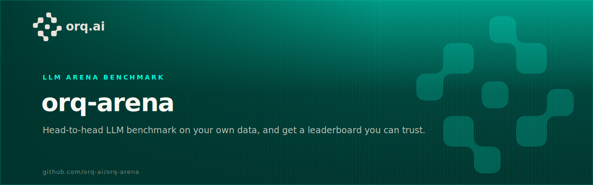
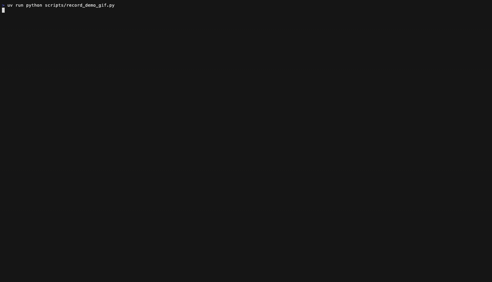

<p align="center">
  
</p>

# orq-arena

[](https://github.com/orq-ai/orq-arena/actions/workflows/ci.yml) [](pyproject.toml) [](LICENSE)

An arena benchmark for LLMs on **your own prompts**. It answers the question every model pool raises: **"which of these models actually wins on *my* prompts, and can I trust the ranking?"**

One headless command runs a round-robin over your pool: an LLM jury judges every round from both seat orders, a **Bradley-Terry ELO leaderboard** with confidence intervals comes out the other end, and the run finishes by opening a self-contained **HTML report** you can hand to anyone. A live terminal show ships too, as the bonus.


## Why orq-arena?

Scoring one model against a rubric is a solved problem; that is [evaluatorq](https://github.com/orq-ai/evaluatorq). What it doesn't give you is a **ranking of a whole pool**: when five models all pass your evals, which one should be the default? Absolute scores saturate; pairwise preference under a bias-controlled jury still separates them.

orq-arena is that missing layer. It runs a round-robin over any pool of models reachable through the [orq.ai router gateway](https://docs.orq.ai/docs/ai-gateway) (one OpenAI-compatible client, one API key, every provider) and hands every verdict to evaluatorq's pairwise jury: each judge sees the pair in *both orders*; a judge that contradicts itself abstains and is recorded as position-biased; a degraded panel yields `inconclusive` rather than a fake verdict.

**Use it when you want to:**

- Pick a default model for a product on **your own prompts**, not a public leaderboard's
- Re-rank the pool when a new model drops: one command, ~10 minutes, exact token accounting
- Generate **pairwise preference data** (`battles.jsonl`) with per-judge votes for later analysis
- Check whether "thinking" actually helps on your workload (uniform ON vs OFF pools)

## What you get

- **A defensible ranking**: pairwise judging in both seat orders, per-round Bradley-Terry with ties, bootstrap 95% CIs, Fleiss'/Cohen's κ, and a seeded manifest per run.
- **A report you can forward**: every run ends with a self-contained HTML page: a plain-words verdict, the ELO ladder with error bars, an ELO-vs-cost value map, speed, token and dollar accounting.
- **Real benchmark data out the back**: every round lands in `battles.jsonl` (schema v2) with both responses, reconciled per-judge votes, exact token/reasoning-token usage, per-response timing.
- **Headless by default**: plain log lines on pipes, a progress bar on terminals, matches in parallel; drop it in CI or cron as-is.
- **Jury swaps without regeneration**: re-judge any recorded run with a different panel and get a rank-stability answer (Spearman).
- **A human anchor in one file**: `annotate` renders any recorded run into a blind browser page (no names, no jury votes, seeded side swaps); send it to raters, feed their `votes.json` to `anchor`, and get panel-vs-human κ plus rank correlation.
- **A live show when you want one**: `--tui` streams the same run as a CRT-neon arena: side-by-side responses, judge cards calling out position-biased votes, HP drama. `orq-arena demo` replays one with no API key.

## Installation

Requires **Python >= 3.10** and [uv](https://docs.astral.sh/uv/).

```bash
git clone https://github.com/orq-ai/orq-arena.git
cd orq-arena
uv sync
```

## Quick start

1. Get an API key from your [orq.ai](https://my.orq.ai) workspace: `cp .env.example .env`, then fill in `ORQ_API_KEY` (loaded automatically).
2. Point the roster at your pool (or keep the shipped 8-model `orq_arena.yaml`) and run:

```bash
uv run orq-arena run --config orq_arena.yaml --prompts your_prompts.jsonl
```

The preflight prints exact call counts and a spend ceiling, asks once, then matches run in parallel with plain log lines. When the last round lands, the **HTML report opens in your browser** (`--no-open` to skip, `--yes` to skip the pause; both make it CI-ready).

Bring your prompts either way:

```bash
# a local JSONL, one prompt per line ("category" is optional)
uv run orq-arena run --config orq_arena.yaml --prompts your_prompts.jsonl

# or an orq.ai Dataset, straight from your workspace
uv run orq-arena run --config orq_arena.yaml --prompts orq:<dataset_id>
```

```jsonl
{"prompt": "Summarize this incident report for a customer email.", "category": "support"}
{"prompt": "Draft the SQL for monthly active users by plan.", "category": "analytics"}
```

Dataset-backed runs record the [Dataset](https://docs.orq.ai/docs/ai-studio/optimize/datasets)'s id, name, and studio URL in the manifest, and the report links it by name. If each match should see every prompt, pass `--rounds <n>`; the preflight warns when it samples a subset.

No key yet? Watch a recorded tournament first: `uv run orq-arena demo` (zero API calls).

## Usage

**Run the benchmark**: `uv run orq-arena run --config orq_arena.yaml` (headless, parallel, report at the end). Without `--config` the interactive roster picker opens over your workspace-enabled catalog, which runs the live TUI. Full flag reference: **[docs/cli.md](docs/cli.md)**.

**Share the result**: the report (`<log>.report.html`) is one self-contained file: a verdict banner naming the top three models with win rate, ELO score, and total cost, the ELO ladder with CI bars, len-ctrl column, an ELO-vs-cost value map, a Speed section (tok/s, time-to-first-token), win grid, jury behaviour, and a link back to the source Dataset on Dataset-backed runs. Regenerate any time with `uv run orq-arena report battles.jsonl`; no model calls (one catalog read prices the cost section when a key is present).

**Re-judge with a different jury**: the responses are already in `battles.jsonl`, so swapping the panel costs judge tokens only: `uv run orq-arena rejudge battles.jsonl --judge mistral/mistral-small-2603`. Prints the new jury's behaviour and the Spearman correlation against the recorded ranking. Multi-judge example: **[docs/cli.md](docs/cli.md)**.

## The live show (bonus)

The same run, projected: `uv run orq-arena run --config orq_arena.yaml --tui` streams both models side by side with judge cards that call out position-biased votes in public. `s` saves an SVG screenshot, `q` quits. Try it with no API key: `uv run orq-arena demo`.



From the final leaderboard, `B` pages through every judged round (prompt, both responses, per-judge votes with flip badges); `M` generates per-model coach notes from an analyzer model. Screenshots and keys: [docs/cli.md](docs/cli.md).

## Configuration

Everything lives in `orq_arena.yaml`, no flags to remember. The default pool is **uniform thinking-OFF** (verified per model against the live router) so the ELO compares models, not vendor defaults; `configs/reasoning_arena.yaml` is the thinking-ON counterpart. Reasoning recipes per provider, replacement judges, and every other key: **[docs/configuration.md](docs/configuration.md)**.

**Not locked to orq.ai.** The engine speaks plain OpenAI-compatible chat: point `gateway.base_url` at any endpoint that speaks that format and set `api_key_env` to match. The orq.ai router is the default because one key covers every provider (and powers the roster picker); it is the recommended path, not the only one. Details: [docs/configuration.md](docs/configuration.md#bring-your-own-endpoint).

```yaml
candidates:
  - model_id: anthropic/claude-opus-4-8
  - model_id: google/gemini-3.1-pro-preview
    reasoning: { thinking: { type: disabled } }   # raw router fields, verbatim

judges:
  - anthropic/claude-haiku-4-5-20251001
  - google/gemini-2.5-flash-lite
min_successful_judges: 2   # jury-of-one -> inconclusive, never a verdict
```

## How the number is made

- **Pairwise, same prompt, both seat orders**: the Chatbot-Arena family of methodology, with evaluatorq's consistency gate on top.
- **Per-round Bradley-Terry MLE with bootstrap 95% CIs**: a default run rates on up to 140 comparisons, not 7 knockouts; overlapping intervals are the honest output on small runs.
- **Length-controlled rating alongside the raw one**: the LMArena / length-controlled-AlpacaEval move. Bradley-Terry refit with a normalized length-difference covariate, the jury's length coefficient reported in public, and the ELO shown with that preference priced out. A model can still win by being longer; it can't do it invisibly.
- **A model loses on its words, never on its network**: a dead stream retries once, then the round is voided; read-gap timeouts (default 20 min of silence) never penalize slow thinkers.
- **Self-aware and reproducible**: Fleiss'/Cohen's κ and per-judge flip rates ship with the standings; every run writes a seeded manifest (config/prompt hashes, panel, evaluatorq version). Full methodology, bias controls, tie handling, voided-round bookkeeping, manifest schema: **[docs/methodology.md](docs/methodology.md)**.

## Documentation

Full guides live at **[orq-ai.github.io/orq-arena](https://orq-ai.github.io/orq-arena/)** (source in [`docs/`](docs/)); start with the [docs index](docs/index.md) for a reading order tailored to your goal.

| Guide | Description |
|-------|-------------|
| [Getting Started](docs/getting-started.md) | Prerequisites, install, first live run, common setup issues |
| [CLI Reference](docs/cli.md) | Every command and flag, `run`, `demo`, `rejudge`, `jury-compare`, `report`, `annotate`, `anchor`, `list-models`, `refresh-models` |
| [Configuration](docs/configuration.md) | Every `orq_arena.yaml` key, reasoning recipes, defaults |
| [Methodology](docs/methodology.md) | Bradley-Terry scoring, bias controls, confidence intervals, reproducibility |
| [Architecture](docs/architecture.md) | Component overview, data flow, key abstractions |
| [Testing](docs/testing.md) | Running the suite and writing new tests |
| [Development](docs/development.md) | Local dev setup, code style, contribution workflow |

## Running tests

Run the full suite with `uv run pytest`. See [docs/testing.md](docs/testing.md) for coverage requirements and how to write new tests.

## Contributing

Bug reports, feature ideas, documentation fixes, and pull requests are all welcome; see [CONTRIBUTING.md](CONTRIBUTING.md).

## Related projects

- **[evaluatorq](https://github.com/orq-ai/evaluatorq)**: the evaluation framework doing the judging here (pairwise juries, red teaming, agent simulation).
- **[orq-auto-router-evaluation](https://github.com/orq-ai/orq-auto-router-evaluation)**: benchmark the Orq Auto Router on quality, cost, and latency over your own workload.
- **[orq-python](https://github.com/orq-ai/orq-python)**: the official typed SDK for the same router surface, reasoning controls included.
- **[Orq.ai docs](https://docs.orq.ai)**: the router gateway, evaluators, and platform.

## License

MIT, see [LICENSE](LICENSE) for details.
