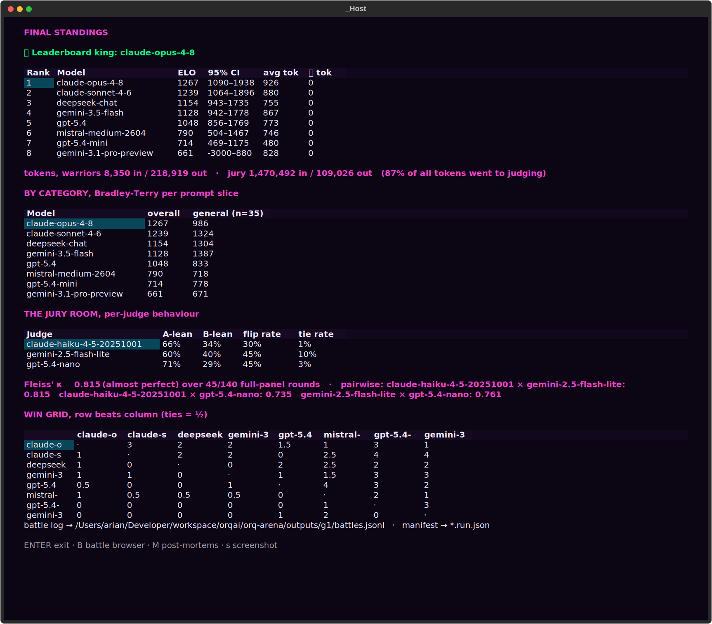
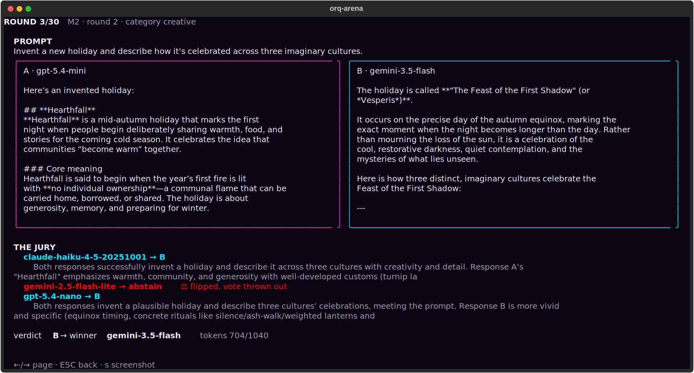
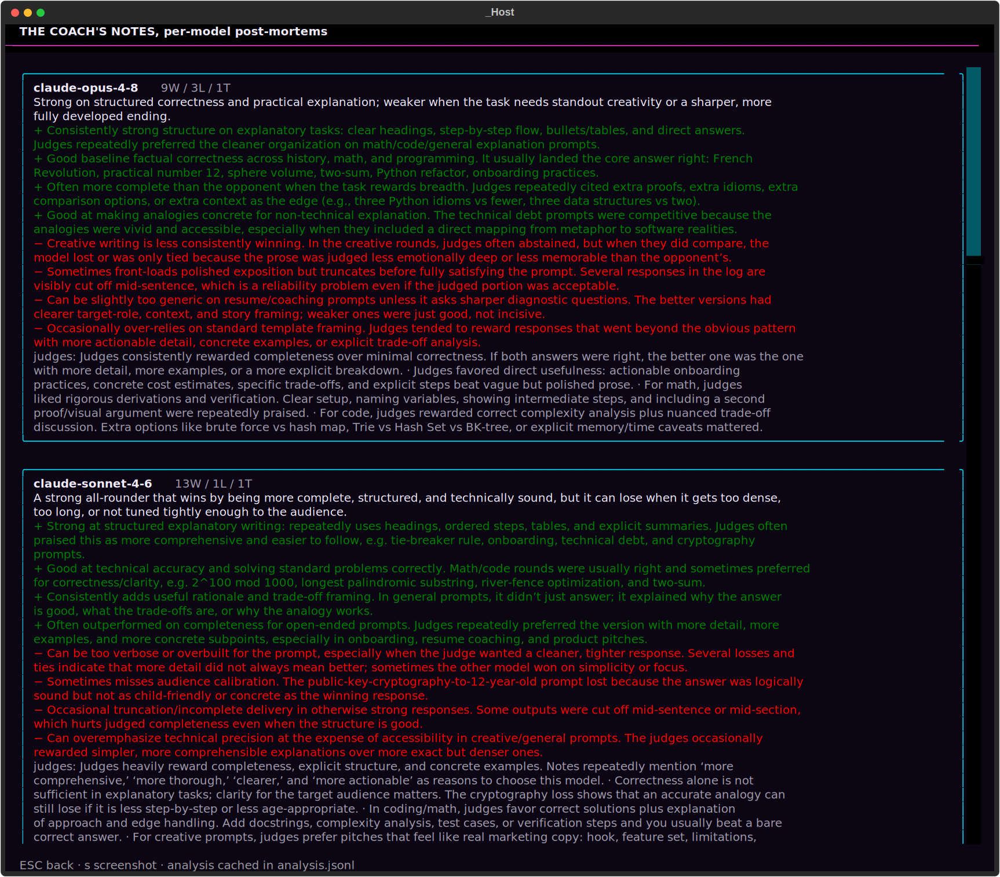

<!-- generated-by: gsd-doc-writer -->
<p align="center">
  
</p>

# orq-arena

[](https://github.com/orq-ai/orq-arena/actions/workflows/ci.yml) [](pyproject.toml) [](LICENSE)

A terminal arena where LLMs fight, and the fight is a real benchmark. It answers the question every model pool raises: **"which of these models actually wins on *my* prompts, and can I trust the ranking?"**

Models stream answers side by side, an LLM jury judges every round from both seat orders, HP bars drop, and a **Bradley-Terry ELO leaderboard** comes out the other end with confidence intervals attached. The arena is the show; the data is the point.



## Why orq-arena?

Scoring one model against a rubric is a solved problem; that is [evaluatorq](https://github.com/orq-ai/evaluatorq). What it doesn't give you is a **ranking of a whole pool**: when five models all pass your evals, which one should be the default? Absolute scores saturate; pairwise preference under a bias-controlled jury still separates them.

orq-arena is that missing layer. It runs a round-robin over any pool of models reachable through the [orq.ai router gateway](https://docs.orq.ai/docs/ai-gateway) (one OpenAI-compatible client, one API key, every provider) and hands every verdict to evaluatorq's pairwise jury: each judge sees the pair in *both orders*; a judge that contradicts itself abstains and is recorded as position-biased; a degraded panel yields `inconclusive` rather than a fake verdict.

**Use it when you want to:**

- Pick a default model for a product on **your own prompts**, not a public leaderboard's
- Re-rank the pool when a new model drops: one command, ~10 minutes, exact token accounting
- Generate **pairwise preference data** (`battles.jsonl`) with per-judge votes for later analysis
- Check whether "thinking" actually helps on your workload (uniform ON vs OFF pools)

## What you get

- **A defensible ranking**: pairwise judging in both seat orders, per-round Bradley-Terry with ties, bootstrap 95% CIs, Fleiss'/Cohen's κ, and a seeded manifest per run.
- **Zero-friction start**: `orq-arena demo` replays a recorded tournament with no API key.
- **A live show worth projecting**: a CRT-neon TUI with streaming responses, judge cards that call out position-biased votes in public, HP drama, live standings.
- **Real benchmark data out the back**: every round lands in `battles.jsonl` (schema v2) with both responses, reconciled per-judge votes, exact token/reasoning-token usage, TTFT.
- **Jury swaps without regeneration**: re-judge any recorded run with a different panel and get a rank-stability answer (Spearman).
- **Headless for CI/cron**: same benchmark, parallel matches, no TUI.

## Installation

Requires **Python >= 3.10** and [uv](https://docs.astral.sh/uv/).

```bash
git clone https://github.com/orq-ai/orq-arena.git
cd orq-arena
uv sync
```

## Quick start

The fastest way to see everything, with **no API key needed**:

```bash
uv run orq-arena demo
```

When you are ready for a live run against real models:

1. Get an API key from your [orq.ai](https://my.orq.ai) workspace: `cp .env.example .env`, then fill in `ORQ_API_KEY` (loaded automatically).
2. Start a tournament: a roster picker opens over your workspace-enabled model catalog; choose any pool ≥ 2: `uv run orq-arena run`
3. Confirm the preflight (exact match/stream/judge-call counts, thinking probe) and the arena begins. In the TUI: `s` saves an SVG screenshot, `q` quits.

## Usage

**Run a tournament**: `uv run orq-arena run` opens the interactive roster picker; add `--config orq_arena.yaml` to run the YAML roster as-is, or `--headless --yes` for CI/cron (no TUI, matches run in parallel). Full flag reference: **[docs/cli.md](docs/cli.md)**.

**Browse the results**: from the final leaderboard, `B` pages through every judged round (prompt, both responses, per-judge votes with flip badges); `M` generates per-model coach notes from an analyzer model.





**Re-judge with a different jury**: the responses are already in `battles.jsonl`, so swapping the panel costs judge tokens only: `uv run orq-arena rejudge battles.jsonl --judge mistral/mistral-small-2603`. Prints the new jury's behaviour and the Spearman correlation against the recorded ranking. Multi-judge example: **[docs/cli.md](docs/cli.md)**.

## Configuration

Everything lives in `orq_arena.yaml`, no flags to remember. The default pool is **uniform thinking-OFF** (verified per model against the live router) so the ELO compares models, not vendor defaults; `configs/reasoning_arena.yaml` is the thinking-ON counterpart. Reasoning recipes per provider, replacement judges, and every other key: **[docs/configuration.md](docs/configuration.md)**.

```yaml
warriors:
  - model_id: anthropic/claude-opus-4-8
  - model_id: google/gemini-3.1-pro-preview
    reasoning: { thinking: { type: disabled } }   # raw router fields, verbatim

judges:
  - anthropic/claude-haiku-4-5-20251001
  - google/gemini-2.5-flash-lite
min_successful_judges: 2   # jury-of-one -> inconclusive, never a verdict
```

## How the number is made

- **Pairwise, same prompt, both seat orders**: the Chatbot-Arena family of methodology, with evaluatorq's consistency gate on top.
- **Per-round Bradley-Terry MLE with bootstrap 95% CIs**: a default run rates on up to 140 comparisons, not 7 knockouts; overlapping intervals are the honest output on small runs.
- **A model loses on its words, never on its network**: a dead stream retries once, then the round is voided; read-gap timeouts (default 20 min of silence) never penalize slow thinkers.
- **Self-aware and reproducible**: Fleiss'/Cohen's κ and per-judge flip rates ship with the standings; every run writes a seeded manifest (config/prompt hashes, panel, evaluatorq version). Full methodology, bias controls, tie handling, voided-round bookkeeping, manifest schema: **[docs/methodology.md](docs/methodology.md)**.

## Documentation

Full guides live in [`docs/`](docs/); start with the [docs index](docs/README.md) for a reading order tailored to your goal.

| Guide | Description |
|-------|-------------|
| [Getting Started](docs/getting-started.md) | Prerequisites, install, first live run, common setup issues |
| [CLI Reference](docs/cli.md) | Every command and flag, `run`, `demo`, `rejudge`, `list-warriors`, `refresh-models` |
| [Configuration](docs/configuration.md) | Every `orq_arena.yaml` key, reasoning recipes, defaults |
| [Methodology](docs/methodology.md) | Bradley-Terry scoring, bias controls, confidence intervals, reproducibility |
| [Architecture](docs/architecture.md) | Component overview, data flow, key abstractions |
| [Testing](docs/testing.md) | Running the suite and writing new tests |
| [Development](docs/development.md) | Local dev setup, code style, contribution workflow |

## Running tests

Run the full suite with `uv run pytest`. See [docs/testing.md](docs/testing.md) for coverage requirements and how to write new tests.

## Contributing

Bug reports, feature ideas, documentation fixes, and pull requests are all welcome; see [CONTRIBUTING.md](CONTRIBUTING.md).

## Related projects

- **[evaluatorq](https://github.com/orq-ai/evaluatorq)**: the evaluation framework doing the judging here (pairwise juries, red teaming, agent simulation).
- **[orq-auto-router-evaluation](https://github.com/orq-ai/orq-auto-router-evaluation)**: benchmark the Orq Auto Router on quality, cost, and latency over your own workload.
- **[orq-python](https://github.com/orq-ai/orq-python)**: the official typed SDK for the same router surface, reasoning controls included.
- **[Orq.ai docs](https://docs.orq.ai)**: the router gateway, evaluators, and platform.

## License

MIT, see [LICENSE](LICENSE) for details.
