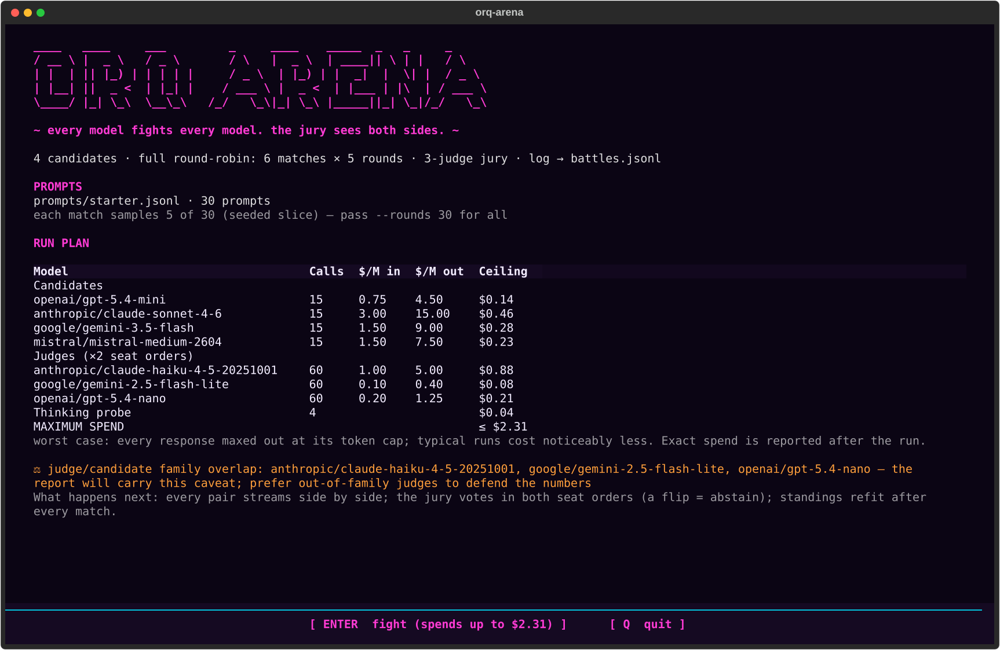
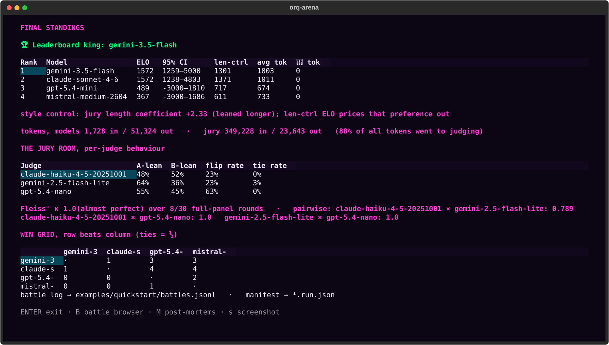

# Run Your Own LLM Arena: Ranking Models on Your Own Data

*Public leaderboards tell you which model the crowd prefers. They can't tell you which model wins on your workload. Here is how Chatbot Arena-style ELO ranking works, why it keeps discriminating when eval scores go flat, and how to run one yourself with orq-arena, our new open-source arena benchmark.*

<!-- tags: LLMs, Evals, Open Source -->

A new model ships every few weeks, and each one tops a leaderboard somewhere. The question your team actually faces is more specific: is it better for our use case, and is the cheaper one good enough? A public ranking cannot answer that, because it is built on someone else's data.

Public leaderboards rank models on prompts that may even have leaked into training sets. More importantly, the prompts on Chatbot Arena are whatever the crowd typed that month. Your product's prompts are support tickets, SQL generation, contract summaries, or something else the crowd never sends. A model that is #1 on the public arena can be a mid-table player on your distribution, and you won't know until users tell you.

The reliable way to answer the question is to test on your own workload, with the same ranking method the public leaderboards use.

## Why your eval scores go flat

Testing on your own workload runs into a quieter problem: every frontier model now clears a well-built eval suite, and that is exactly when absolute scores stop helping. Most teams grade each model's answers one at a time against a rubric, on a 1-10 scale, and this works right up until it doesn't. Once several models clear the bar, everything reads 9/10 and the ranking goes flat. The evals are saturated. Absolute scoring saturates because the grader has no reference point: "how good is this answer?" is a much harder question than "which of these two answers is better?"

Head-to-head comparison keeps discriminating. Show a judge two answers to the same prompt and ask which is better, and you get signal even between two models that both score 9/10 in isolation. This is the same technique the big human-preference leaderboards use, and it is the reason they can still separate frontier models when benchmark scores are bunched within a point of each other.

This is the problem arena-style ranking was built for.

## How arena-style ranking works

Think of a chess tournament, but the players are your models. Every comparison is a game: two models answer the same prompt, a judge picks a winner, and the winner takes rating points from the loser. Do this across many prompts and many pairings and a ladder emerges, where the rating gap between two models predicts how often one beats the other. A 100-point ELO gap translates to roughly a 64% expected win rate; a 20-point gap means the matchup is close to a coin flip.

The important nuance: ELO measures preference, not accuracy. It answers "which answer does the judge pick when both are on the table", which is usually what you care about for product quality, but it is not a correctness score. A model can be preferred and still wrong; that is what your task-specific evals are for. The two measurements complement each other, and the arena earns its keep exactly where absolute scores stop separating candidates.

Under the hood, modern leaderboards don't actually run incremental chess ELO, where ratings drift with match order. They fit a [Bradley-Terry model](https://en.wikipedia.org/wiki/Bradley%E2%80%93Terry_model), the 1952 statistical model behind paired-comparison ranking, over all games at once. The fit finds the set of ratings that best explains every observed win and loss, is independent of match order, and comes with confidence intervals. This is the statistical core of Chatbot Arena's leaderboard (Chiang et al., 2024), and it is what orq-arena runs too.

## Replace the crowd with a jury, carefully

Chatbot Arena gets its verdicts from millions of human votes. You don't have a crowd, and you don't need one: LLM judges agree with human preferences often enough to be useful (Zheng et al., 2023). But an LLM jury has documented failure modes, and an arena that ignores them produces confident nonsense. This is where [orq-arena](https://github.com/orq-ai/orq-arena) comes in: a self-hostable arena that runs a round-robin tournament over your model pool, judges every pair blind with an LLM panel, and ships a guard for each known bias.

**Position bias.** LLM judges measurably favor whichever answer they see first. So every judge scores each pair twice, with the sides swapped. A judge that picks A in one order and B in the other has told you it cannot really tell them apart, so it abstains for that round and the flip is recorded and published per judge. No silent coin flips.

**Verbosity bias.** Seat-swapping fixes position bias, not length bias: a jury that likes longer answers likes them in both orders. Following length-controlled AlpacaEval (Dubois et al., 2024) and LMArena's style control, orq-arena refits the ranking with a length term and reports a length-controlled rating next to the raw one. A big gap between the two columns means verbosity, not quality, is doing the separating, and the report will show it.

**Self-preference.** LLM judges recognize and favor their own family's prose (Panickssery et al., 2024). A judge that is also a contestant is excluded from its own matches, and the preflight warns whenever a judge shares a provider family with any candidate. The clean setup is a jury drawn entirely from families outside the pool.

**The jury of one.** A single judge's verdict is an anecdote. Each round needs at least two decisive, order-consistent votes to count; otherwise it is marked inconclusive and never reaches the rating. Every run also closes with the jury's agreement stats (Fleiss' kappa, per-judge flip rates), so the ranking ships with the evidence needed to challenge it.

## Run it on your data

One command runs the whole tournament:

```bash
uv tool install .   # from the cloned repo
orq-arena run --config orq_arena.yaml --prompts your_prompts.jsonl
```

Models and judges are called through the [orq.ai router gateway](https://docs.orq.ai/docs/ai-gateway), so one API key covers every provider; the judging itself runs on [evaluatorq](https://github.com/orq-ai/evaluatorq), our open-source library for exactly this kind of pairwise jury.

Before spending anything, the preflight prints a Run Plan: the full pool, every judge, the exact number of API calls, and a worst-case dollar ceiling per model. It asks once, then runs matches in parallel.



When the last round lands you get three artifacts:

- **A shareable HTML report.** One self-contained file: verdict first, then the ELO ladder with error bars, the length-controlled column, a quality-vs-cost chart, latency, the win grid, and the exact dollar spend.
- **Raw preference data.** Every judged round lands in `battles.jsonl` with both responses, each judge's vote, exact token counts, and per-response timing. That is real pairwise preference data for whatever you want to do next.
- **A swappable jury.** The responses are already recorded, so `rejudge` re-scores the run under a different panel for judge tokens only, and reports how much the ranking moved. There is also a human-anchor workflow: `annotate` renders the run into a blind page you can send to human raters, and `anchor` compares their votes with the panel's.



## When to trust the ranking

An arena run is only as defensible as its uncertainty reporting, so orq-arena refuses to overstate its own results. Every rating carries a bootstrapped 95% confidence interval, and when two models' intervals overlap, the report says "not statistically distinguishable at this sample size" instead of pretending the ladder positions mean something. On a small run the intervals are wide; that is the honest output.

The same honesty applies to the defaults. The shipped 30-prompt bank and budget judge trio are a smoke test, sized to exercise every mechanism in an afternoon for a few dollars, not to defend a ranking. A ranking you intend to act on takes your own prompt set, hundreds of judged rounds, and judges from model families outside your candidate pool. The methodology and every control described above are documented in the [methodology page](https://orq-ai.github.io/orq-arena/methodology/), and the implementation is open source, so the full detail is the code itself.

## Run it on the next model drop

Public leaderboards are a fine tiebreaker and a terrible verdict. When the next model ships, re-running the benchmark answers the question in one command, with exact token accounting and a report you can put in front of the team.

- **Code**: [github.com/orq-ai/orq-arena](https://github.com/orq-ai/orq-arena) (MIT, Python >= 3.10)
- **Docs**: [getting started and CLI reference](https://orq-ai.github.io/orq-arena/)
- **Judging library**: [evaluatorq](https://github.com/orq-ai/evaluatorq)
- **Gateway**: every call routes through the [orq.ai AI gateway](https://docs.orq.ai/docs/ai-gateway), one key for every provider

Point it at your prompts, read the Run Plan, and find out what makes sense for your data.
