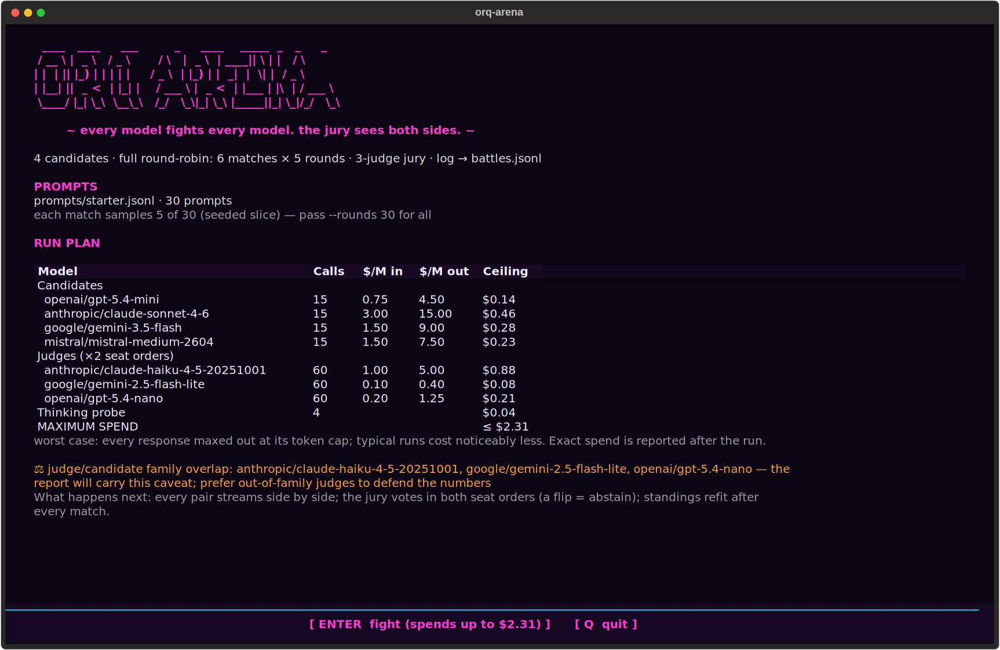
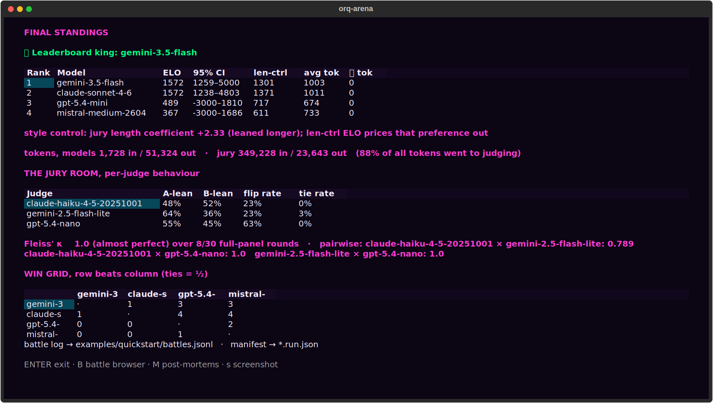
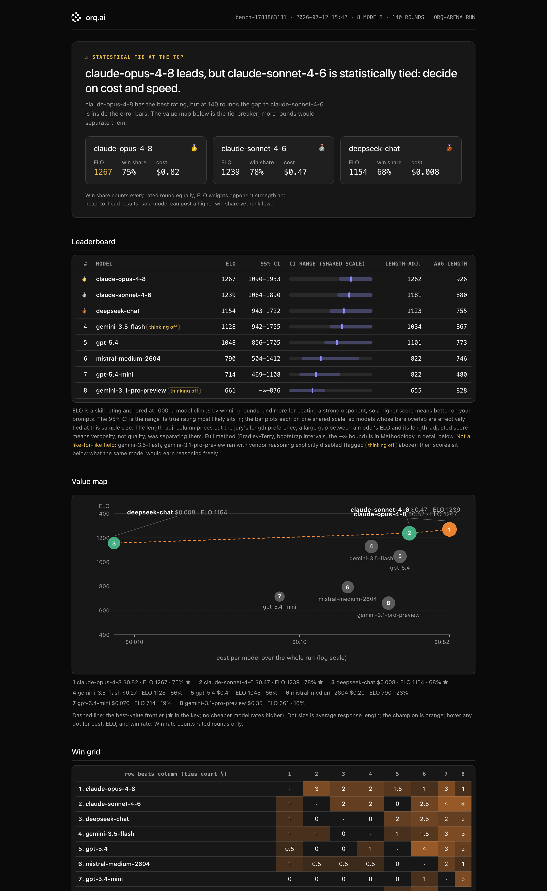

# CLI Reference

`orq-arena` is the command-line tool for everything in this project: running the
benchmark, replaying it, re-judging it, and turning a recorded run into reports and
human-annotation pages.

It has seven subcommands: [`run`](#run), [`pool`](#pool),
[`rejudge`](#rejudge) (including its [`--compare`](#rejudge-compare) mode), [`report`](#report),
[`annotate`](#annotate), [`anchor`](#anchor), and [`refresh-catalog`](#refresh-catalog).
`--version` and `--help` work at the top level; every other flag below belongs to a
specific subcommand.

```bash
orq-arena --help              # list every subcommand
orq-arena <command> --help    # per-command flag help
```

```text
Usage: orq-arena [OPTIONS] COMMAND [ARGS]...

  orq-arena, LLM arena benchmark: orq.ai router + evaluatorq jury.

Options:
  --version  Show the version and exit.
  --help     Show this message and exit.

Commands:
  anchor           Merge human vote files against a recorded run: κ +...
  annotate         Render a blinded human-annotation page from a recorded...
  pool             Print the configured candidate pool.
  refresh-catalog  Re-fetch the workspace-enabled chat model catalog from...
  rejudge          Re-judge a recorded run with a different panel, zero...
  report           Render the single-file HTML report page from a...
  run              Run the arena benchmark (hits orq.ai): headless logs...
```

For installation and your first run, see [getting-started.md](getting-started.md). For the
full `orq_arena.yaml` key reference, see [configuration.md](configuration.md).

## At a glance

| Command | Purpose |
|---|---|
| [`run`](#run) | Round-robin benchmark via the orq.ai router: headless by default, HTML report written next to the log (`--open` to view), `--tui` for the live show. |
| [`pool`](#pool) | Print the configured candidate pool (seed, name, model id). |
| [`rejudge`](#rejudge) | Re-score a recorded `battles.jsonl` with a different judge panel, zero regeneration; or, with [`--compare`](#rejudge-compare), tabulate saved rejudge reports side by side. |
| [`report`](#report) | Render the single-file HTML report page from a recorded run; no model calls, one optional catalog read for prices. |
| [`annotate`](#annotate) | Render a blinded human-annotation page from a recorded run; no API calls. |
| [`anchor`](#anchor) | Merge human vote files back against a run: panel↔human κ + rank correlation; no API calls. |
| [`refresh-catalog`](#refresh-catalog) | Force re-fetch of the 24h workspace model-catalog cache. |

---

## Shared behaviors

A few things apply across every subcommand and are only documented once, here:

- **`.env` loading**: every invocation reads `./.env` from the current directory before
  doing anything else. **A variable already set in your shell always wins over `.env`.**
  `ORQ_API_KEY` is the only variable the tool reads. Details (quoting, comments,
  missing-file handling): [configuration.md](configuration.md#environment-variables).
- **Config validation is all-or-nothing**: the *entire* `--config` file
  is validated (≥2 `candidates`, non-empty `judges`, thinking-budget
  cross-checks, etc.) regardless of which fields a given subcommand actually uses. An
  invalid config file fails the same way for `pool` or `refresh-catalog` as it does for
  `run`, see [Required vs Optional Settings](configuration.md#required-vs-optional-settings).
- **Default paths**: every default path in the tables below is one of these four, all
  relative to the current working directory:

  | Value | Used by |
  |---|---|
  | `orq_arena.yaml` | `--config` default on `rejudge`, `report`, and `refresh-catalog`; `run` and `pool` require an explicit `--config` (`annotate` and `anchor` take no config) |
  | `prompts/starter.jsonl` | `run --prompts` |
  | `battles.jsonl` | `run --output`, and the `LOG_PATH` positional on `rejudge` and `report` |

- **`--version`**: `orq-arena --version` prints the installed package version.
- **Stream contract**: results go to stdout; messaging (preflight narration, warnings,
  progress) goes to stderr. Piping stdout to `grep`, `jq`, or a file never captures
  progress noise.
- **Which commands need `ORQ_API_KEY`:**

  | Command | Needs a live API key? |
  |---|---|
  | `run` | Yes, model streams, judge calls, and (if enabled) the thinking probe all call the gateway. |
  | `pool` | No, prints the parsed config only. |
  | `rejudge` | Yes, re-scores recorded responses with a live judge panel. |
  | `report` | No, one optional catalog read prices the cost section when a key (or cache) is present. |
  | `annotate` / `anchor` | No, both work entirely from the recorded log and vote files. |
  | `refresh-catalog` | Effectively yes, without it, falls back to any existing cache, then an empty result. See [`refresh-catalog`](#refresh-catalog). |

---

## `run`

Run the benchmark (a full round-robin over the pool), hits orq.ai. The model pool
comes from the YAML you point `--config` at, as-is. The run is
headless: matches in parallel, plain log lines on pipes, a progress bar on
terminals, and the HTML report is written next to the battle log at the end
(`--open` to view it in your browser). `--tui` runs
the same tournament as the live show instead; it needs the optional `[tui]`
extra and prints a friendly install hint without it.
The headless run needs no extra.

```text
orq-arena run --config PATH [--prompts PATH] [--output PATH] [--rounds N]
              [--overwrite] [--tui] [--open] [--yes|-y] [--quiet|-q]
```

| Flag | Default | Effect |
|---|---|---|
| `--config PATH` | (required) | YAML config: candidates (the model pool), judges, match, gateway; used exactly as written. |
| `--prompts PATH` | `prompts/starter.jsonl` | JSONL prompt file, see [Prompts file format](configuration.md#prompts-file-format), or `orq:<dataset_id>` to pull an [orq.ai Dataset](https://docs.orq.ai/docs/ai-studio/optimize/datasets): each datapoint's last user message becomes a prompt, `{{var}}` placeholders filled from its `inputs`; datapoints without a user message are skipped. Uses the same API key as the gateway. When the prompts come from a Dataset, the run manifest records its id, display name, and studio URL, and the HTML report links the dataset by name. |
| `--output PATH` | `battles.jsonl` | Where the battle log (schema v3) is written as rounds complete. |
| `--rounds N` | `match.max_rounds` from the YAML | Rounds per match. The preflight warns when this samples a subset of your prompts. |
| `--overwrite` | off | Allow replacing an existing non-empty battle log at `--output`; without it the run refuses rather than erase a recorded run. |
| `--tui` | off | Watch the live TUI show instead of headless logs. Headless runs use `headless_concurrency` (default `4`, see [configuration.md](configuration.md)) to parallelize matches. |
| `--open` | off | Open the HTML report in a browser when the run ends (ignored on non-TTY stdout or when `CI` is set). |
| `--yes`, `-y` | off | Skip the preflight confirmation pause. Required when stdin is not a terminal (pipes, CI): without it the run fails fast instead of hanging on a prompt nobody can answer. |
| `--quiet`, `-q` | off | Suppress preflight narration and progress; warnings and the final results stay. |

### How a run behaves

**The model pool is the YAML's `candidates` list, verbatim.** Preflight and the confirmation
prompt happen up front in the terminal, before the TUI (or headless run) even starts. To
discover which model ids your workspace can fight, see
[`refresh-catalog`](#refresh-catalog) (`--show` lists them grouped by provider).

**Preflight: call counts.** The first line is exact arithmetic, not an estimate:

```text
preflight: {matches} matches × {rounds_per_match} rounds → {model_streams} model streams + {judge_calls} judge calls[ + {probe_calls} probe calls]
```

Every pair of candidates plays one match, each match runs `min(--rounds, number of prompts)`
rounds, every round streams both contestants once and is scored by each judge twice (once
per seat order).

**Preflight: the RUN PLAN table** (see the expected output below). One row per candidate and
judge (call count, catalog price in $/M in / $/M out, worst-case cost), closing with a bold
`MAXIMUM SPEND ≤ $X` row.

- The total is an **upper bound**, not a prediction: it assumes every response hits its
  output token cap. Prices come from the router's Model Garden catalog.
- **Unpriced models** (normal for self-hosted) keep their row with `n/a` prices and a `?`
  cost; the total renders `≤ $X + ?` with a `no catalog price (self-hosted or unpriced): …`
  note below. If pricing is entirely unreachable the table is skipped. Pricing never blocks
  the run.
- **`--quiet`** suppresses the table but a one-line `maximum spend ≤ $X (worst case)` still
  prints, cost survives quiet mode.
- The ceiling and its per-row breakdown land in the run manifest under
  `preflight.cost_ceiling`.

**Preflight: the thinking probe** (`preflight.thinking_probe`, default `true`). A
`thinking probe…` line, then one line per candidate that failed
(`⚠ {name} ({model}): probe failed, {error}`) or thinks despite being configured off
(`🧠 {name} ({model}): thinks despite config …, ranking will be footnoted`). No surprises →
`pool is thinking-clean ✓`.

**Confirmation.** Unless `--yes`/`-y` is given, the CLI prompts `Proceed (spends up to $X)?`,
so the dollar bound sits in the approval question itself (plain `Proceed?` when nothing could
be priced). Declining aborts before any battle or judge calls (the thinking probe, when
enabled, has already made its one probe stream per model). When stdin is not an interactive
terminal the run errors out with a "pass `--yes`" hint instead of prompting.

**Streams.** Preflight narration, warnings, per-match lines, and the progress bar print to
stderr; the Final Results, token totals, battle-log path, and report-page path print to
stdout. `1>results.txt` captures only the results; `2>/dev/null` silences the chatter.

**Output.** Every judged round is appended to `--output` (`battles.jsonl`, schema v3) as the
run proceeds, live-run or headless alike.

**Examples:**

```bash
# Fight the shipped pool, confirm the preflight interactively
orq-arena run --config orq_arena.yaml

# Same, skipping the confirmation prompt
orq-arena run --config orq_arena.yaml --yes

# CI/cron -- headless is the default; matches run in parallel (headless_concurrency)
orq-arena run --config orq_arena.yaml --yes

# Custom prompt set and output path, with an alternate pool
orq-arena run --config configs/reasoning_arena.yaml --prompts prompts/starter.jsonl --output reasoning_battles.jsonl
```

**Expected output** (headless, piped, both streams shown interleaved; everything above
`Final Results` is stderr; reconstructed from the committed
[`examples/quickstart`](https://github.com/orq-ai/orq-arena/tree/master/examples/quickstart) run's
recorded manifest and log, its 8-model pool against the default judge trio):

```text
$ orq-arena run --config examples/quickstart/config.yaml -y \
    --output examples/quickstart/battles.jsonl
preflight: 28 matches × 5 rounds → 280 model streams + 840 judge calls + 8 probe calls
  ⚖ judge/contestant family overlap: anthropic/claude-haiku-4-5-20251001, google/gemini-2.5-flash-lite, openai/gpt-5.4-nano. Self-preference bias is not corrected by seat swapping; prefer judges from families outside the pool.
                                   RUN PLAN
┏━━━━━━━━━━━━━━━━━━━━━━━━━━━━━━━━━━━━━━━┳━━━━━━━┳━━━━━━━━┳━━━━━━━━━┳━━━━━━━━━━┓
┃ Model                                 ┃ Calls ┃ $/M in ┃ $/M out ┃ Ceiling  ┃
┡━━━━━━━━━━━━━━━━━━━━━━━━━━━━━━━━━━━━━━━╇━━━━━━━╇━━━━━━━━╇━━━━━━━━━╇━━━━━━━━━━┩
│ Candidates                            │       │        │         │          │
│   anthropic/claude-opus-4-8           │    35 │   5.00 │   25.00 │   $1.80  │
│   anthropic/claude-sonnet-4-6         │    35 │   3.00 │   15.00 │   $1.08  │
│   openai/gpt-5.4                      │    35 │   2.50 │   15.00 │   $1.08  │
│   openai/gpt-5.4-mini                 │    35 │   0.75 │    4.50 │   $0.32  │
│   google/gemini-3.1-pro-preview       │    35 │   2.00 │   12.00 │   $0.86  │
│   google/gemini-3.5-flash             │    35 │   1.50 │    9.00 │   $0.65  │
│   deepseek/deepseek-chat              │    35 │   0.14 │    0.28 │   $0.02  │
│   mistral/mistral-medium-2604         │    35 │   1.50 │    7.50 │   $0.54  │
│ Judges (×2 seat orders)               │       │        │         │          │
│   anthropic/claude-haiku-4-5-20251001 │   280 │   1.00 │    5.00 │   $4.11  │
│   google/gemini-2.5-flash-lite        │   280 │   0.10 │    0.40 │   $0.35  │
│   openai/gpt-5.4-nano                 │   280 │   0.20 │    1.25 │   $0.97  │
│ Thinking probe                        │     8 │        │         │   $0.09  │
├───────────────────────────────────────┼───────┼────────┼─────────┼──────────┤
│ MAXIMUM SPEND                         │       │        │         │ ≤ $11.87 │
└───────────────────────────────────────┴───────┴────────┴─────────┴──────────┘
     worst case: every response maxed out at its token cap; typical runs
         cost noticeably less. Exact spend is reported after the run.
thinking probe…
  pool is thinking-clean ✓
M1 round 1: inconclusive
M1 round 1: A
M1 round 2: inconclusive
M1 round 2: B
M1 round 3: A
M1 gpt-5.4-mini beats gemini-3.1-pro-preview
match 1/28 done
M2 round 1: A
… (one line per judged round; A/B are the round's seat labels; an
inconclusive round redraws a prompt, so round numbers can repeat)
M2 gpt-5.4 beats deepseek-chat
match 2/28 done
M3 🤝 draw
match 3/28 done
…
M28 🤝 draw
match 28/28 done

🏆 gemini-3.5-flash leads, but claude-sonnet-4-6 is statistically tied (CIs
overlap at 76 rated rounds; the report page has the tie-breakers)

                    Final Results
┏━━━┳━━━━━━━━━━━━━━━━━━━━━━━━┳━━━━━━┳━━━━━━━━━━━┳━━━━━━┓
┃ # ┃ Model                  ┃ ELO  ┃ 95% CI    ┃ win% ┃
┡━━━╇━━━━━━━━━━━━━━━━━━━━━━━━╇━━━━━━╇━━━━━━━━━━━╇━━━━━━┩
│ 1 │ gemini-3.5-flash       │ 1374 │ 1218–2162 │ 86%  │
│ 2 │ claude-sonnet-4-6      │ 1196 │ 1016–1897 │ 79%  │
│ 3 │ gpt-5.4                │ 1174 │ 997–1893  │ 76%  │
│ 4 │ claude-opus-4-8        │ 1072 │ 905–1737  │ 61%  │
│ 5 │ deepseek-chat          │ 1016 │ 870–1627  │ 52%  │
│ 6 │ mistral-medium-2604    │ 901  │ 665–1531  │ 40%  │
│ 7 │ gpt-5.4-mini           │ 805  │ 421–1410  │ 27%  │
│ 8 │ gemini-3.1-pro-preview │ 463  │ -3000–603 │ 5%   │
└───┴────────────────────────┴──────┴───────────┴──────┘

jury: 90% mean agreement · leaned longer (+3.44); the report prices it out
rounds: 76 rated · 0 voided
tokens, models 8,350 in / 220,700 out · jury 1,481,428 in / 107,697 out

battle log → examples/quickstart/battles.jsonl
report page → examples/quickstart/battles.report.html
```

On a terminal (not piped) the per-round heartbeat lines are replaced by a pinned
progress bar (spinner, rounds M-of-N, elapsed, current leader) that advances once per
round, with the per-match lines printing above it; without `-y` the run pauses at
`Proceed (spends up to $11.87)? [y/N]` after the preflight, before any battle or
judge call.

See [Match rules, gateway, candidates, and judges](configuration.md) for every YAML key this
command reads, and [methodology.md](methodology.md) for how matches are scheduled and scored.

---

## The `--tui` live show

`orq-arena run --tui` opens on the **RUN PLAN screen**: the branding, the prompt set and its
size, and the full per-model cost table (every candidate and judge listed, worst-case ceiling
per row), ending in the run's one confirmation, `ENTER fight (spends up to $X)` / `Q quit`.
Nothing has been spent when it renders except the tiny thinking-probe calls; `-y` skips the
screen and starts the fight directly. On endpoints without catalog pricing the table keeps
its call counts and the ceiling reads `unavailable`.



The run ends on the **Final Results screen**: ELO with its 95% CI and len-ctrl rating per
model, the per-category slices, per-judge behaviour (A/B lean, flip rate, tie rate, Fleiss'
κ), and the win grid.



**From the final leaderboard**: `B` opens the battle browser, paging through every judged
round with the prompt, both responses, and per-judge votes with flip badges; `s` saves an
SVG screenshot; `q` quits.


---

## `pool`

Print the configured candidate pool, no API calls, no key required.

```text
orq-arena pool --config PATH [--json]
```

| Flag | Default | Effect |
|---|---|---|
| `--config PATH` | (required) | YAML config whose `candidates` are printed. |
| `--json` | off | Print the pool as a JSON array of `{seed, name, model_id}` objects instead of the table. |

**Behavior notes:**

- Prints a fixed-width table: seed number, `name` (falls back to the model's short name,
  see [configuration.md](configuration.md#candidates-the-model-pool)), and the full `model_id`,
  in config order, 1-indexed.

**Expected output**, against the shipped `orq_arena.yaml` (8 candidates, none with a custom `name`):

```bash
orq-arena pool --config orq_arena.yaml
```

```text
Seed  Name                       Model ID
----------------------------------------------------------------------
1     claude-opus-4-8            anthropic/claude-opus-4-8
2     claude-sonnet-4-6          anthropic/claude-sonnet-4-6
3     gpt-5.4                    openai/gpt-5.4
4     gpt-5.4-mini               openai/gpt-5.4-mini
5     gemini-3.1-pro-preview     google/gemini-3.1-pro-preview
6     gemini-3.5-flash           google/gemini-3.5-flash
7     deepseek-chat              deepseek/deepseek-chat
8     mistral-medium-2604        mistral/mistral-medium-2604
```

```bash
orq-arena pool --config configs/reasoning_arena.yaml
```

---

## `rejudge`

Re-judge a recorded run with a different panel, zero regeneration. The responses in the
battle log are already on disk, so swapping the jury costs judge tokens only. `rejudge` has two
mutually exclusive modes: the default `--judge` mode re-scores a log with a new panel, and
[`--compare`](#rejudge-compare) tabulates saved rejudge reports side by side (no API calls).

```text
orq-arena rejudge [LOG_PATH] --judge MODEL_ID [--judge MODEL_ID ...] [--criteria TEXT]
                  [--config PATH] [--output PATH] [--report-json PATH] [--concurrency N]
orq-arena rejudge --compare REPORT_JSON [--compare REPORT_JSON ...]
```

| Argument / Flag | Default | Effect |
|---|---|---|
| `log_path` (positional) | `battles.jsonl` | Recorded battle log to re-judge (schema v3 JSONL). Optional, omit it to re-judge the default log in the current directory. Ignored in `--compare` mode. |
| `--judge MODEL_ID` | none, **required unless `--compare`, repeatable** | Router model id for the new panel; pass `--judge` multiple times for a multi-judge panel. Mutually exclusive with `--compare`. |
| `--compare REPORT_JSON` | none, **repeatable** | Switches to compare mode: tabulate the given saved rejudge report JSONs side by side (see [`rejudge --compare`](#rejudge-compare)). Mutually exclusive with `--judge`; makes no API calls. |
| `--criteria TEXT` | `criteria` from `--config` | Override the judging criteria for this rejudge only, doesn't touch the YAML file. |
| `--config PATH` | `orq_arena.yaml` | Supplies `gateway`, and (unless overridden) `criteria`, `replacement_judges`, and `min_successful_judges`. |
| `--output PATH` | none, result only printed | Write the re-judged rounds to this JSONL path. |
| `--report-json PATH` | none, result only printed | Write the run summary as JSON. |
| `--concurrency N` | `4` | Max concurrent judge calls. |

**Behavior notes:**

- **Which rounds are re-judged.** Only complete rounds: rows with both responses present
  and no recorded error. Voided or errored rounds are silently skipped. If nothing
  qualifies, the command exits with `no judgeable rounds in {log_path}`.
- **Self-judge exclusion.** For each contestant pair, any `--judge` that *is* one of the
  contestants is dropped from that pair's panel, the same rule live matches apply.
  Contestants are matched against the pool recorded in the `<log>.run.json` manifest, the
  pool the run actually used, never the current YAML, which may have drifted since.
  Without a manifest the CLI warns and falls back to `--config`. If exclusion leaves a
  pair with no judges at all, the command errors with
  `every judge is a contestant in {pair}`; add a neutral model to `--judge` to fix it.
- **Small panels are fine.** The YAML's `min_successful_judges` quorum (sized for the
  original run's, typically larger, panel) is clamped down to the rejudge panel's size, so
  a legitimate 1- or 2-judge rejudge is never rejected by a quorum meant for a bigger jury.
- **Report contents:**
  - `re-judged {N} rounds, {M} verdicts changed` (vs. the recorded `majority_verdict`)
  - Spearman rank correlation between the old and new Bradley-Terry rankings, labeled
    `judge-robust ranking` at `>= 0.8`, otherwise `ranking is panel-sensitive; treat with care`
  - `old ranking: A > B > C ...` and `new ranking: ...` strings
  - a **"new jury behaviour"** table, one row per judge: `A-lean`, `B-lean`, `flip rate`
    (position bias, how often a judge's verdict flips depending on seat order), `tie rate`
  - `mean inter-judge agreement`, when the panel has more than one judge
- **`--output`** writes one JSONL row per input record with `judge_votes`, `majority_verdict`,
  and `winner` replaced by the new panel's verdict; every other field (prompt, both
  responses, tokens, timings) is copied through unchanged.
- **`--report-json`** writes:

  ```json
  {
    "total": 0,
    "changed_verdicts": 0,
    "spearman": 0.0,
    "old_ranking": ["..."],
    "new_ranking": ["..."],
    "jury": { "...": "full evaluatorq report, including per_judge stats" }
  }
  ```

**Examples:**

```bash
# Single-judge rejudge of the default log against the default config
orq-arena rejudge battles.jsonl --judge mistral/mistral-small-2603

# Multi-judge panel
orq-arena rejudge battles.jsonl --judge mistral/mistral-small-2603 --judge anthropic/claude-haiku-4-5-20251001

# Override criteria, write both the rejudged log and a JSON summary
orq-arena rejudge battles.jsonl \
  --judge mistral/mistral-small-2603 \
  --criteria "Correctness only; ignore style." \
  --output battles.rejudged.jsonl \
  --report-json rejudge_report.json

# Higher concurrency against a non-default log
orq-arena rejudge my_battles.jsonl --judge openai/gpt-5.4-nano --concurrency 8
```

**Expected output** (illustrative; the table shape and labels are exact, the numbers are
from a single-judge rejudge of the committed example run):

```text
$ orq-arena rejudge examples/quickstart/battles.jsonl --judge openai/gpt-5.1

re-judged 30 rounds, 6 verdicts changed
rank correlation (Spearman) old→new: 0.80 , judge-robust ranking
old ranking: gemini-3.5-flash > claude-sonnet-4-6 > gpt-5.4-mini > mistral-medium-2604
new ranking: claude-sonnet-4-6 > gemini-3.5-flash > gpt-5.4-mini > mistral-medium-2604
       new jury behaviour
┏━━━━━━━━━┳━━━━━━━━┳━━━━━━━━┳━━━━━━━━━━━┳━━━━━━━━━━┓
┃ judge   ┃ A-lean ┃ B-lean ┃ flip rate ┃ tie rate ┃
┡━━━━━━━━━╇━━━━━━━━╇━━━━━━━━╇━━━━━━━━━━━╇━━━━━━━━━━┩
│ gpt-5.1 │ 48%    │ 52%    │ 10%       │ 13%      │
└─────────┴────────┴────────┴───────────┴──────────┘
```

Below a Spearman of 0.8 the second line reads
`, ranking is panel-sensitive; treat with care` instead, and a
`mean inter-judge agreement: NN%` line follows the table whenever the panel
has more than one judge.

---

## `rejudge --compare`

Compare candidate juries over the same recorded log, a mode of [`rejudge`](#rejudge) selected by
passing `--compare` instead of `--judge`. The selection loop: run once, then for each candidate
panel `rejudge <log> --judge ... --report-json candidate.json` (judge tokens only), then compare
the saved reports with `rejudge --compare`. Makes no API calls.

```text
orq-arena rejudge --compare REPORT_JSON [--compare REPORT_JSON ...]
```

!!! warning "`--compare` is a repeated flag, not a list"

    Pass `--compare` once **per report**: `--compare solo.json --compare panel.json`.
    A bare second path (`--compare solo.json panel.json`) silently binds to the
    `LOG_PATH` positional instead, and the table tabulates only the first report.

Columns per candidate: Spearman vs the recorded ranking (does the ranking depend on this
jury?), inconclusive rate (decisiveness), mean agreement, worst per-judge flip rate
(self-consistency), tie rate, changed verdicts. These measure reliability, not accuracy;
which jury is *right* needs gold pairs or a human anchor (see [`annotate`](#annotate) and [`anchor`](#anchor)).

```bash
orq-arena rejudge battles.jsonl --judge openai/gpt-5.1 --report-json solo.json
orq-arena rejudge battles.jsonl --judge anthropic/claude-haiku-4-5-20251001 \
  --judge openai/gpt-5.1 --report-json panel.json
orq-arena rejudge --compare solo.json --compare panel.json
```

**Expected output** (the report JSONs carry the numbers; the compare step itself makes no API calls):

```text
                                  jury candidates over the same recorded log
┏━━━━━━━━━━━━━━━━━┳━━━━━━━━━━━━━━━━━┳━━━━━━━━━━━━━━┳━━━━━━━━━━━┳━━━━━━━━━━━━━━━━━┳━━━━━━━━━━┳━━━━━━━━━━━━━━━━┓
┃ panel           ┃ spearman vs run ┃ inconclusive ┃ agreement ┃ worst flip      ┃ tie rate ┃ changed        ┃
┃                 ┃                 ┃              ┃           ┃ (judge)         ┃          ┃ verdicts       ┃
┡━━━━━━━━━━━━━━━━━╇━━━━━━━━━━━━━━━━━╇━━━━━━━━━━━━━━╇━━━━━━━━━━━╇━━━━━━━━━━━━━━━━━╇━━━━━━━━━━╇━━━━━━━━━━━━━━━━┩
│ gpt-5.1         │ 0.80            │ 10%          │ n/a       │ 10% (gpt-5.1)   │ 13%      │ 6/30           │
│ claude-haiku-4… │ 1.00            │ 17%          │ 86%       │ 13% (gpt-5.1)   │ 7%       │ 3/30           │
│ gpt-5.1         │                 │              │           │                 │          │                │
└─────────────────┴─────────────────┴──────────────┴───────────┴─────────────────┴──────────┴────────────────┘
read: high spearman = the ranking does not depend on this jury; low inconclusive = decisive; low flip =
self-consistent. These measure reliability, not accuracy; accuracy needs gold pairs or a human anchor.
```

## `report`

Render the single-file HTML report page from a recorded run. Reads `battles.jsonl` and its
`*.run.json` manifest; makes no model calls (one catalog read prices the cost section when a
key is present). The same page is written automatically at the end
of every run (`<log>.report.html` next to the log).



```text
orq-arena report [LOG_PATH] [--config PATH] [--output PATH]
```

| Flag / arg | Default | Effect |
|---|---|---|
| `LOG_PATH` (positional) | `battles.jsonl` | The recorded run to render. |
| `--config PATH` | `orq_arena.yaml` | Supplies the judge panel and the model-name mapping for the report's statistics rebuild; match rules are not consulted. |
| `--output PATH` | `<log>.report.html` | Destination HTML file. |

The page is self-contained (inline CSS, no external assets, works from `file://`): verdict
headline with a CI-overlap caveat, the ELO ladder with confidence-interval bars and the
len-ctrl column, the win grid, per-judge behaviour, token and cost accounting (catalog
rates when a key is present: candidate spend exact, jury spend estimated at the panel mean;
one catalog read, never completion spend), and the
manifest hashes for reproducibility.

```bash
orq-arena report outputs/g1/battles.jsonl
orq-arena report battles.jsonl --output /tmp/run.html
```

**Expected output** (one line; without a key the page's cost section is simply omitted,
nothing warns or fails):

```text
$ orq-arena report examples/quickstart/battles.jsonl
report page -> examples/quickstart/battles.report.html
```

## `annotate`

Render a blinded human-annotation page from a recorded run. Reads `battles.jsonl`; makes no
API calls. This is the front half of the human-anchor workflow (the back half is
[`anchor`](#anchor)): the accuracy check that converts "the panel agrees with itself" into
"the panel agrees with people" (see
[Methodology → Human anchor](methodology.md#human-anchor-does-the-panel-agree-with-people)).

```text
orq-arena annotate BATTLE_LOG [--output PATH] [--sample N] [--seed N] [--criteria TEXT]
                  [--exclude VOTES_JSON ...] [--serve] [--port N]
```

| Flag / arg | Default | Effect |
|---|---|---|
| `BATTLE_LOG` (positional) | required | The recorded run to annotate. |
| `--output PATH` | `annotate.html` | Destination HTML file. |
| `--sample N` | all rounds | Annotate a seeded random subset instead of every round. |
| `--criteria TEXT` | the jury's default rubric | Judging guidelines shown to the rater. |
| `--seed N` | `42` | Drives round order and per-round side flips; keep it if you want two raters on identical pages. |
| `--exclude PATH` | none | votes.json file(s), repeatable: rounds already voted there are dropped, producing a resume page with only the remaining rounds (or a top-up page when growing a study). |
| `--serve` | off | Prodigy-style local mode: serve the page at `http://127.0.0.1:<port>` instead of writing a file. Every vote saves automatically as `votes-<annotator>.json` next to the log (no download step); Ctrl-C stops the server and prints the anchor table for whatever was voted. Localhost-only by construction; for remote raters use the default file mode. |
| `--port N` | `8765` | Port for `--serve`; `0` picks a free one. |

The page is one self-contained HTML file (inline CSS/JS, no external assets, works from
`file://`), so "deployment" is sending someone the file. It is **blind by construction**:
model names, jury votes, and verdicts never enter the payload; rounds are shuffled and the
two responses swap sides per round under the seed; round keys are one-way hashes.

The rater's flow has three views. An **intro** states what the task is, the round count, a
rough time estimate, the criteria to weigh (`--criteria`, defaulting to the jury's default
rubric), the key legend, and asks for their name. The **annotation view** shows one prompt
and two anonymous responses; votes go by `a` (left better), `b` (right better), `t` (tie),
`space` (skip), arrows to navigate; markdown and code fences render properly. After the last
round a **done screen** shows how many rounds were voted vs skipped and holds the explicit
"Download votes.json" button (plus a leave-warning while votes are undownloaded; left arrow
goes back to revisit skips). A persistent header count (voted / skipped / left) and a
clickable per-round dot navigator (voted, tie, skipped, unseen, current) keep position
visible at all times; `n` jumps to the next unvoted round. Exported votes are already
un-flipped to the canonical A/B frame, so the vote file is independent of presentation
order.

```bash
orq-arena annotate outputs/g1/battles.jsonl --sample 60
orq-arena annotate battles.jsonl --output rater2.html --seed 42
# resume: only the rounds dana hasn't voted yet
orq-arena annotate battles.jsonl --exclude votes-dana.json --output dana-round2.html
# annotate your own run locally, votes save as you click, Ctrl-C prints the numbers
orq-arena annotate outputs/g1/battles.jsonl --serve --sample 60
```

**Expected output** (file mode; `--serve` prints the local URL instead and holds until Ctrl-C):

```text
$ orq-arena annotate examples/quickstart/battles.jsonl --output annotate.html --sample 10
10 rounds -> annotate.html (blind; votes export as votes.json)
```

## `anchor`

Merge one or more human vote files back against the recorded run and print the human-anchor
numbers; no API calls.

```text
orq-arena anchor BATTLE_LOG VOTES_JSON [VOTES_JSON ...] [--json]
```

| Flag / arg | Default | Effect |
|---|---|---|
| `BATTLE_LOG` (positional) | required | The same log the annotation page was generated from. |
| `VOTES_JSON` (positional, repeatable) | required | Vote files exported by the annotation page, one per rater. |
| `--json` | off | Print the same stats as one JSON object (`per_annotator`, `inter_annotator`, `panel_ranking`, `unknown_keys`) instead of the table; undefined Spearman values become `null`. |

Output, per annotator: rounds voted, rounds usable for κ (the panel must have been decisive;
inconclusive rounds are excluded from κ but still feed the human Bradley-Terry fit), Cohen's
κ vs the panel majority with its Landis-Koch label, and the Spearman correlation between the
human-vote Bradley-Terry ranking and the panel's. With two or more vote files it also prints
each rater pair's inter-annotator κ over their shared rounds. Votes whose key matches no
round in the log are counted and warned, never crash.

```bash
orq-arena anchor outputs/g1/battles.jsonl votes-h1.json votes-h2.json
```

**Expected output** (two raters over the committed example run):

```text
                         human anchor vs panel
┏━━━━━━━━━━━┳━━━━━━━┳━━━━━━━━━━┳━━━━━━━━━━━━┳━━━━━━━━━━━━━━━━┳━━━━━━━━┓
┃ annotator ┃ voted ┃ κ rounds ┃ κ vs panel ┃ label          ┃ rank ρ ┃
┡━━━━━━━━━━━╇━━━━━━━╇━━━━━━━━━━╇━━━━━━━━━━━━╇━━━━━━━━━━━━━━━━╇━━━━━━━━┩
│ h1        │ 29    │ 19       │ 0.90       │ almost perfect │ 0.80   │
│ h2        │ 27    │ 19       │ 0.80       │ substantial    │ 0.80   │
└───────────┴───────┴──────────┴────────────┴────────────────┴────────┘
inter-annotator h1 × h2: κ=0.44 (moderate, 26 rounds)
```

## `refresh-catalog`

Re-fetch the workspace-enabled chat model catalog from orq.ai, bypassing the cache.

```text
orq-arena refresh-catalog [--config PATH] [--show/--no-show]
```

| Flag | Default | Effect |
|---|---|---|
| `--config PATH` | `orq_arena.yaml` | Only `gateway` is used (base URL, API key env var name). |
| `--show` / `--no-show` | `--no-show` (off) | Print every fetched model id, grouped by provider. |

**Behavior notes:**

- Bypasses the 24h cache at `~/.cache/orq-arena/models.json` and re-fetches the
  workspace-enabled, chat-capable catalog live from orq.ai. Non-chat models (embeddings,
  TTS/STT, image, rerank, moderation, etc.) are filtered out. Use `--show` to discover
  model ids for your YAML's `candidates` list; the same catalog also prices the preflight
  spend ceiling and the report's cost section.
- **Without `ORQ_API_KEY`:** the command doesn't error, it skips the live fetch and falls
  back to any existing cache; with no cache either, it prints `0 models (source=fallback, ...)`
  (this command passes no fallback ids of its own).
- Only a **successful** live fetch overwrites the cache file, without a key, or if every
  candidate URL fails, the existing cache (if any) is left untouched and simply re-reported.
- Always prints one summary line (to stderr, per the stream contract; `--show`'s model list
  is the stdout payload):
  `{count} models (source={live|cache|fallback}, age={seconds}s, cache={path})`.
- `--show` additionally prints every model id grouped by provider (providers and ids both
  sorted):

  ```text
  anthropic  (6)
    anthropic/claude-haiku-4-5-20251001
    anthropic/claude-opus-4-8
    ...

  openai  (9)
    openai/gpt-5.4
    openai/gpt-5.4-mini
    ...
  ```

**Examples:**

```bash
orq-arena refresh-catalog
orq-arena refresh-catalog --show
orq-arena refresh-catalog --config configs/reasoning_arena.yaml --show
```

**Expected output** (here keyless, so the live fetch is skipped and the cache re-reported;
with a key, `source=live` and `age=0s`):

```text
$ orq-arena refresh-catalog
137 models (source=cache, age=4528s, cache=/Users/you/.cache/orq-arena/models.json)
```

---

## Common workflows

### See it work with zero setup

No key yet? Open the committed example run's report,
[`examples/quickstart/battles.report.html`](https://github.com/orq-ai/orq-arena/tree/master/examples/quickstart),
or regenerate it keyless from the committed log:

```bash
orq-arena report examples/quickstart/battles.jsonl
```

Then get a key: https://docs.orq.ai/docs/ai-studio/organization/api-keys.

### First live run

```bash
cp .env.example .env   # fill in ORQ_API_KEY
orq-arena run --config orq_arena.yaml
```

Fights the shipped `orq_arena.yaml` pool headless; edit its `candidates` list to change the
pool. Confirm the preflight to spend tokens.

### Run for CI/cron

```bash
orq-arena run --config orq_arena.yaml --yes
```

`--yes` skips the confirmation prompt, safe for a non-interactive shell; plain line-per-match
output on pipes.

### Compare two juries on the same recorded run

```bash
orq-arena rejudge battles.jsonl --judge mistral/mistral-small-2603 --judge anthropic/claude-haiku-4-5-20251001
```

Costs judge tokens only, the responses already in `battles.jsonl` are reused as-is. Prints
the changed-verdict count and the Spearman rank correlation against the original ranking.

### Discover model ids for your model pool

```bash
orq-arena refresh-catalog --show
```

Forces a live re-fetch (bypassing the 24h cache) and lists every workspace-enabled chat model
id, grouped by provider, ready to paste into your YAML's `candidates` list.

---

## Scripting & CI

Everything you need to run `orq-arena` unattended or pipe its output:

- **Confirmation**: `run` requires `--yes`/`-y` when stdin is not a terminal; without it the
  command fails immediately with that hint instead of hanging on a prompt.
- **Streams**: results on stdout, messaging (preflight narration, warnings, progress) on
  stderr. `orq-arena run --config orq_arena.yaml -y 1>results.txt 2>run.log` separates them cleanly.
- **Quiet**: `run --quiet`/`-q` drops narration and progress; warnings and the final
  standings still print.
- **No animations off-TTY**: when stderr is not a terminal the progress bar is replaced by
  plain line-per-match output, so CI logs stay readable. The HTML report never auto-opens
  off-TTY or when `CI` is set.
- **Machine-readable output**: `pool --json` and `anchor --json` print JSON to stdout;
  `rejudge --report-json <file>` writes its summary as JSON.
- **Color**: output honors the standard `NO_COLOR` and `FORCE_COLOR` environment
  variables and disables color on non-TTY streams automatically.
- **Exit codes**: `0` success, `1` any runtime error (printed as `Error: …` on stderr),
  `2` usage error (unknown flag, bad value).

---

## See also

| Doc | What it covers |
|---|---|
| [Getting Started](getting-started.md) | Prerequisites, install, first live run, common setup issues |
| [Configuration Reference](configuration.md) | Every `orq_arena.yaml` key, `.env` loading, reasoning recipes, defaults |
| [Methodology](methodology.md) | How the ranking is made, bias controls, confidence intervals, reproducibility |
| [README](https://github.com/orq-ai/orq-arena/blob/master/README.md) | Project overview, installation, quick start |
