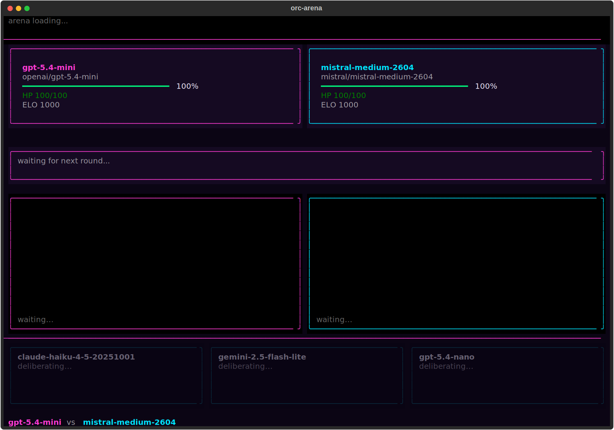
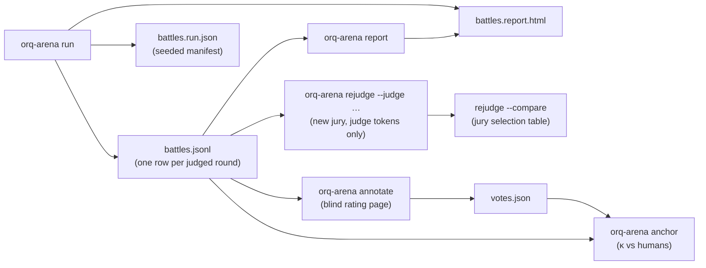

# Getting Started

This guide takes you from a fresh clone to a live tournament, a round-robin of LLMs
streaming answers side by side, judged in both seat orders by an evaluatorq pairwise jury,
ranked by Bradley-Terry ELO with confidence intervals attached.

The end-to-end path is:

1. Install the toolkit (`uv sync`).
2. Try the zero-key demo, see the whole show with no credentials.
3. Add your orq.ai API key (`.env`).
4. Run a live tournament, clear the preflight, watch the fight, read the leaderboard.
5. Know where your results land, and what to do if something goes wrong.

Every command below runs through the **`orq-arena`** CLI (installed by the steps in
[1. Install](#1-install)). Run `uv run orq-arena --help` to list every subcommand. The full
subcommand and flag reference is in **[cli.md](cli.md)**.

!!! tip "No API key yet?"

    Skip straight to [2. Try it now](#2-try-it-now-no-api-key-needed),
    `orq-arena demo` replays a full recorded tournament with no network calls. Come back to
    step 3 when you're ready to point at real models.

---

## Prerequisites

| Requirement | Minimum | How to check |
|---|---|---|
| Python | `>= 3.10` | `python3 --version` |
| [uv](https://docs.astral.sh/uv/getting-started/installation/) | any recent | `uv --version` |
| Git | any | `git --version` |
| orq.ai workspace | active, with at least one chat model enabled | [my.orq.ai](https://my.orq.ai) |

You only need the workspace for **live** runs, the demo needs none of it. When you do go
live, you need:

- A workspace **API key** (`ORQ_API_KEY`) from [my.orq.ai](https://my.orq.ai) > workspace
  settings > API keys (per `.env.example`). It's the only secret orq-arena needs, every
  candidate, judge, and preflight-probe call goes through the orq.ai router gateway
  with this one key.

---

## 1. Install

```bash
git clone https://github.com/orq-ai/orq-arena.git
cd orq-arena
uv sync
```

`uv sync` creates a `.venv` and installs orq-arena plus its core dependencies (`click`,
`pydantic`, `pyyaml`, `openai`, `httpx`, `evaluatorq`) resolved against `uv.lock`. This
registers the **`orq-arena`** console script (entry point `orq_arena.cli:cli` in
`pyproject.toml`'s `[project.scripts]`), every command below is run through `uv run` so this
is the only setup step.

The core install runs the benchmark, the HTML report, and `rejudge`. The Textual live show,
though, is an **optional extra**: the `--tui` live run and `orq-arena demo` need `textual`,
which is not in the core dependencies. Add it with:

```bash
uv sync --extra tui
```

Without the extra, those two commands print a friendly install hint instead of running. If
you only intend to run headless benchmarks, the plain `uv sync` is enough.

---

## 2. Try it now, no API key needed

```bash
uv run orq-arena demo
```

This replays a fully recorded tournament, 3 matches, 6 judged rounds, all 3 default judges
voting, from `fixtures/demo_tournament.json` through the exact same TUI screens a live run
uses: streaming responses, judge verdicts, HP drama, and the final leaderboard. No network
calls, no API key. Press `q` to quit, `s` to save a screenshot.



`demo` renders through the Textual TUI, so it needs the optional `[tui]` extra
(`uv sync --extra tui`, see [1. Install](#1-install)); without it the command prints a friendly
install hint. `demo` still loads `orq_arena.yaml` (only for cosmetic labels like the judge names
in the fight-screen header), it ships in the repo, so this works immediately after
`uv sync --extra tui` with no edits needed. `demo` also takes `--fixture` and `--config` if you
want to point it elsewhere; see [cli.md](cli.md).

---

## 3. Add your orq.ai credentials

```bash
cp .env.example .env
```

Then fill in the one variable it asks for:

```bash
ORQ_API_KEY=your-orq-api-key
```

`.env` is read by a small stdlib-only loader in `src/orq_arena/cli.py` (`_load_dotenv`),
called once at the top of every CLI invocation. It uses `os.environ.setdefault`, so **a
variable already set in your shell always wins**, `.env` only fills in what the shell hasn't
already set. `.env` is git-ignored; only `.env.example` is committed.

`ORQ_API_KEY` is **not** required for `orq-arena demo` or `orq-arena list-models`, only for
`run` and `rejudge`, which construct a gateway client. `refresh-models` wants it too, but
degrades instead of failing: without a key the catalog fetch quietly falls back to any
existing cache, else an empty list. Full variable reference:
[configuration.md](configuration.md#environment-variables).

---

## 4. Run your first live tournament

```bash
uv run orq-arena run
```

The roster comes straight from the YAML (`--config` defaults to the shipped `orq_arena.yaml`;
edit its `candidates` list, or point at `configs/reasoning_arena.yaml`, the uniform
thinking-**ON** counterpart of the default thinking-**OFF** pool, or your own file). The run
is headless by default and walks through three stages:

1. **Preflight.** The CLI prints the exact call counts and a spend ceiling up front, runs a
   thinking probe, one tiny call per candidate ("Reply with the single word: ok") to catch
   vendor-default reasoning that contradicts your config (`🧠 thinks despite config: ...,
   ranking will be footnoted`), then asks `Proceed?` before any battle or judge call
   (the probe itself has already made one paid call per candidate), pass
   `--yes`/`-y` to skip the prompt for CI or scripts. For the shipped `orq_arena.yaml` (8
   candidates) against the default `prompts/starter.jsonl` (30 prompts, capped at
   `match.max_rounds` = 5 per match), that preflight line reads exactly:

    ```
    preflight: 28 matches × 5 rounds → 280 model streams + 840 judge calls + 8 probe calls
    ```

2. **The fight.** Every pair of candidates meets once (a full round-robin over the pool),
   matches in parallel under `headless_concurrency` (default 4). For each prompt, both
   candidates stream through the router, the jury votes in both seat orders, and the round is
   logged. Pass `--tui` to watch it live instead (needs the `[tui]` extra): side-by-side
   streaming, judge verdicts, HP drama, one match at a time.
3. **The leaderboard.** The final Bradley-Terry ELO standings with bootstrap 95% CIs: printed
   in the terminal (headless) and rendered into the HTML report, which opens in your browser
   (`--no-open` to skip; it never opens in CI). In the TUI, press `B` to browse every judged
   round (prompt, both responses, per-judge votes with flip badges), `S` to save a screenshot,
   `ENTER`/`SPACE`/`Q` to exit.


The prompt set is swappable: `--prompts your_prompts.jsonl` for a local file (format:
[Configuration](configuration.md#prompts-file-format)), or `--prompts orq:<dataset_id>` to
fight over an [orq.ai Dataset](https://docs.orq.ai/docs/ai-studio/optimize/datasets) straight
from your workspace, same API key.

To see which model ids your workspace can fight, `uv run orq-arena refresh-models --show`
lists the workspace-enabled catalog, grouped by provider, ready to paste into the YAML.
Full flag reference for `run` and every other subcommand (`demo`, `rejudge` with `--compare`,
`report`, `annotate`, `anchor`, `list-models`, `refresh-models`): **[cli.md](cli.md)**.

---

## Where results land

Every live run, TUI or headless, writes to the same three files, all in the current working
directory by default. Everything downstream, re-judging, reporting, human annotation, works
from the battle log alone, with no further model regeneration:



| File | Contents |
|---|---|
| `battles.jsonl` | One JSON line per judged (or voided) round, `BattleRecord`, schema v3: both responses, reconciled per-judge votes, token/TTFT accounting. (v3 drops the old HP/damage columns, HP is now a TUI-only presentation.) |
| `battles.run.json` | The run manifest, written next to the log, config/prompt hashes, roster, judge panel, seed, and (once finished) agreement stats. |
| `battles.report.html` | A single-file HTML report, no server, no external assets. The verdict banner leads with the top 3 models (win rate, ELO score, total cost); a value map plots ELO against cost per model on a log scale; a Speed section (tokens per second, time to first token) appears whenever the log carries per-side durations. Runs sourced from an orq.ai Dataset (`--prompts orq:<dataset_id>`) link the dataset by name in the report. |

Pass `--output path/to/file.jsonl` to move all three, the manifest and report page always sit
next to whatever `--output` you choose (`Path(battle_log_path).with_suffix(".run.json")` and
`.with_suffix(".report.html")`). All three files are git-ignored; `orq-arena rejudge` (see
[cli.md](cli.md)) reads `battles.jsonl` straight back off disk to re-score a run with a
different jury, at no regeneration cost, and `orq-arena report <log>` regenerates the report
page on demand.

---

## Troubleshooting

??? failure "`RuntimeError: ORQ_API_KEY is not set. Export it before running orq-arena.`"

    `.env` is missing, empty, or still the blank template. Run `cp .env.example .env`, fill in a
    real key from [my.orq.ai](https://my.orq.ai) > workspace settings > API keys, and re-run. This
    only fires on `run` or `rejudge`, `demo`, `list-models`, and `refresh-models` never
    construct a gateway client, so they run with no key at all (`refresh-models` just falls back
    to cached results, or an empty list).

??? failure "`Error: --tui and --headless contradict each other`"

    Both flags were passed to `orq-arena run`; drop one. `--headless` is a deprecated no-op
    (headless is already the default with `--config`); `--tui` opts into the live show.

??? warning "A response panel shows `✂ truncated`"

    The candidate hit its output cap (`gateway.candidate_max_tokens`, default `2048`) before
    finishing, judges tend to penalize a cut-off answer. Raise `gateway.candidate_max_tokens` in
    your YAML, or set a higher per-candidate `max_tokens` on that one entry. See
    [configuration.md](configuration.md#gateway-gatewayconfig).

??? question "A model you expected in the default pool isn't there"

    `orq_arena.yaml` deliberately excludes models the router can't disable thinking for, the
    shipped file's own comment names `moonshotai/kimi-k2.6`, `deepseek/deepseek-v4-pro`, and
    `alibaba/qwen3.5-flash` as excluded for this reason. Mixing an always-thinking model into the
    uniform thinking-**OFF** pool would compare reasoning tokens no config could turn off. Add
    them to `configs/reasoning_arena.yaml` (the thinking-**ON** preset) instead, or add them
    to your own YAML explicitly if a mixed pool is what you want.

---

## Next steps

| Goal | Where to go |
|---|---|
| See every subcommand and flag | [cli.md](cli.md) |
| Understand every `orq_arena.yaml` key | [configuration.md](configuration.md) |
| Understand the scoring methodology | [methodology.md](methodology.md) |
| Contribute to the project | [CONTRIBUTING.md](https://github.com/orq-ai/orq-arena/blob/master/CONTRIBUTING.md) |
| Back to the project overview | [README.md](https://github.com/orq-ai/orq-arena/blob/master/README.md) |
