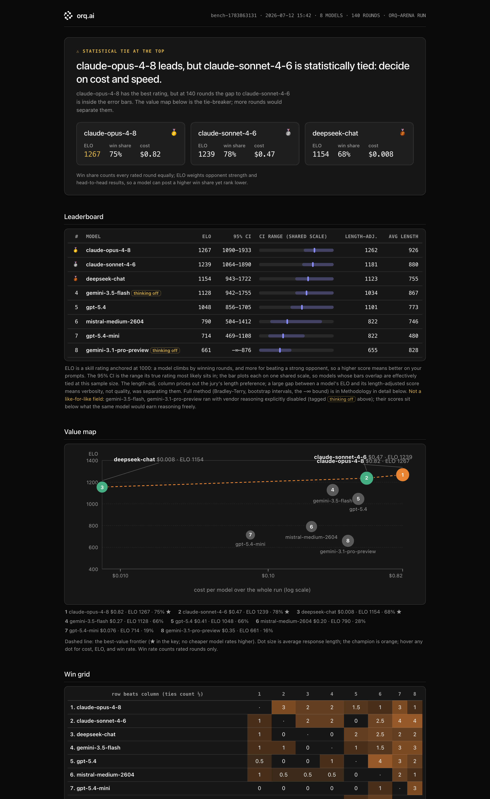

# Getting Started

This guide takes you from a fresh clone to your first benchmark: a round-robin tournament
over your model pool, judged in both seat orders by an evaluatorq pairwise jury, ranked by
Bradley-Terry ELO with confidence intervals attached.

The path is five steps:

1. [Install](#1-install) the CLI (`uv tool install`).
2. [Add your orq.ai API key](#2-add-your-orqai-credentials) (`.env`).
3. [Run the benchmark](#3-run-the-benchmark) and read the standings.
4. [Bring your own prompts](#4-bring-your-own-prompts): a local JSONL file or an
   orq.ai Dataset.
5. [Know where the results land](#5-where-results-land): the battle log, the manifest, and
   the HTML report.

Every command below runs through the **`orq-arena`** CLI. Run `orq-arena --help` to
list every subcommand; the full flag reference is in **[cli.md](cli.md)**.

---

## Prerequisites

| Requirement | Minimum | How to check |
|---|---|---|
| Python | `>= 3.10` | `python3 --version` |
| [uv](https://docs.astral.sh/uv/getting-started/installation/) | any recent | `uv --version` |
| Git | any | `git --version` |
| [orq.ai](https://orq.ai) workspace | active, with at least one chat model enabled | [my.orq.ai](https://my.orq.ai) (sign up at [orq.ai](https://orq.ai) if you don't have one) |

The one secret you need is a workspace **API key** (`ORQ_API_KEY`), created per the
[API keys guide](https://docs.orq.ai/docs/ai-studio/organization/api-keys). Every candidate, judge, and
preflight-probe call goes through the orq.ai router gateway with this one key, so one key
covers every provider in the pool.

---

## 1. Install

```bash
git clone https://github.com/orq-ai/orq-arena.git
cd orq-arena
uv tool install .
```

`uv tool install .` puts the **`orq-arena`** command on your PATH in its own isolated
environment. That's the only setup step: the benchmark, the HTML report, and `rejudge`
all run on it. (Hacking on the code instead? `uv sync` and prefix commands with
`uv run`.)

Check it worked:

```text
$ orq-arena --help
Usage: orq-arena [OPTIONS] COMMAND [ARGS]...

  orq-arena, LLM arena benchmark: orq.ai router + evaluatorq jury.

Options:
  --version  Show the version and exit.
  --help     Show this message and exit.

Commands:
  anchor           Merge human vote files against a recorded run: κ +...
  annotate         Render a blinded human-annotation page from a recorded...
  pool             Print the configured candidate pool.
  refresh-catalog  Re-fetch the workspace-enabled chat model catalog from...
  rejudge          Re-judge a recorded run with a different panel, zero...
  report           Render the single-file HTML report page from a...
  run              Run the arena benchmark (hits orq.ai): headless logs...

  Docs: https://github.com/orq-ai/orq-arena/tree/master/docs · Issues:
  https://github.com/orq-ai/orq-arena/issues
```

---

## 2. Add your orq.ai credentials

```bash
cp .env.example .env
```

Then fill in the one variable it asks for, an API key from your workspace. Two ways to
get one:

=== "From the web app"

    Create a key per the
    [API keys guide](https://docs.orq.ai/docs/ai-studio/organization/api-keys) and copy it
    out of workspace settings.

=== "With the orq CLI"

    If you have the [orq CLI](https://github.com/orq-ai/orq-cli) installed:

    ```bash
    orq auth login
    orq api-keys create --name orq-arena --json
    ```

    The response contains the raw key (`sk-orq-...`), shown once and never retrievable
    again — copy it now. Mint a real API key rather than reusing the login session: an
    API key outlives a long benchmark run, which is what the CLI itself recommends for
    long sessions.

```bash
ORQ_API_KEY=your-orq-api-key
```

`.env` is loaded automatically at the top of every CLI invocation; a variable already set in
your shell always wins over `.env`. `.env` is git-ignored; only `.env.example` is committed.
Full variable reference: [configuration.md](configuration.md#environment-variables).

---

## 3. Run the benchmark

```bash
orq-arena run --config orq_arena.yaml
```

The model pool comes straight from the `candidates` list in the YAML you point `--config`
at; the shipped `orq_arena.yaml` has an 8-model pool to start from. The essentials of that
file:

```yaml
# orq_arena.yaml (trimmed to the essentials)
candidates:                # the model pool: router model ids, any size >= 2
  - model_id: anthropic/claude-sonnet-4-6
  - model_id: openai/gpt-5.4
  - model_id: deepseek/deepseek-chat
  - model_id: google/gemini-3.5-flash
    reasoning: { thinking: { type: disabled } }   # per-model overrides inline

judges:                    # the jury; every pair judged in both seat orders
  - anthropic/claude-haiku-4-5-20251001
  - google/gemini-2.5-flash-lite
  - openai/gpt-5.4-nano

match:
  max_rounds: 5            # prompts judged per match
```

Every key, default, and per-model override is documented in
[configuration.md](configuration.md). The run walks through three stages:

1. **Preflight.** The exact call counts print up front, then a **RUN PLAN table**: one row
   per candidate and judge with its call count, catalog price, and cost, closing with the
   projected spend and the worst case beneath it. A tiny thinking probe runs per candidate,
   then the run pauses at `Proceed (≈ $X, up to $Y with retries)? [y/N]` before any battle or
   judge call. Pass `--yes`/`-y` to skip the pause in CI or scripts.
2. **The matches.** Every pair of candidates meets once (a full round-robin), matches in
   parallel. For each prompt, both candidates stream through the router, the jury votes in
   both seat orders, and the round is logged.
3. **The standings.** Bradley-Terry ELO with bootstrap 95% CIs, printed in the terminal, and
   the HTML report is written next to the battle log (`--open` to view it in your browser).

**Expected output**, regenerated by running the tool against the committed
[`examples/quickstart`](https://github.com/orq-ai/orq-arena/tree/master/examples/quickstart)
run, an 8-model pool against the default judge trio:

```text
$ orq-arena run --config examples/quickstart/config.yaml \
    --output examples/quickstart/battles.jsonl
  ⚠ each match samples 5 of your 30 prompts (a seeded random slice per match). Pass --rounds 30 to use every prompt each match, or raise match.max_rounds in the YAML.
preflight: 28 matches × 5 rounds → 280 model streams + 840 judge calls + 8 probe calls
  ⚖ judge/contestant family overlap: anthropic/claude-haiku-4-5-20251001, google/gemini-2.5-flash-lite, openai/gpt-5.4-nano. Self-preference bias is not corrected by seat swapping; prefer judges from families outside the pool.
                                   RUN PLAN
┏━━━━━━━━━━━━━━━━━━━━━━━━━━━━━━━━━━━━━━━┳━━━━━━━┳━━━━━━━━┳━━━━━━━━━┳━━━━━━━━━━┓
┃ Model                                 ┃ Calls ┃ $/M in ┃ $/M out ┃     Cost ┃
┡━━━━━━━━━━━━━━━━━━━━━━━━━━━━━━━━━━━━━━━╇━━━━━━━╇━━━━━━━━╇━━━━━━━━━╇━━━━━━━━━━┩
│ Candidates                            │       │        │         │          │
│   anthropic/claude-opus-4-8           │    35 │   5.00 │   25.00 │    $1.80 │
│   anthropic/claude-sonnet-4-6         │    35 │   3.00 │   15.00 │    $1.08 │
│   openai/gpt-5.4                      │    35 │   2.50 │   15.00 │    $1.08 │
│   openai/gpt-5.4-mini                 │    35 │   0.75 │    4.50 │    $0.32 │
│   google/gemini-3.1-pro-preview       │    35 │   2.00 │   12.00 │    $0.86 │
│   google/gemini-3.5-flash             │    35 │   1.50 │    9.00 │    $0.65 │
│   deepseek/deepseek-chat              │    35 │   0.14 │    0.28 │    $0.02 │
│   mistral/mistral-medium-2604         │    35 │   1.50 │    7.50 │    $0.54 │
│ Judges (×2 seat orders)               │       │        │         │          │
│   anthropic/claude-haiku-4-5-20251001 │   280 │   1.00 │    5.00 │    $4.11 │
│   google/gemini-2.5-flash-lite        │   280 │   0.10 │    0.40 │    $0.35 │
│   openai/gpt-5.4-nano                 │   280 │   0.20 │    1.25 │    $0.97 │
│ Thinking probe                        │     8 │        │         │    $0.09 │
├───────────────────────────────────────┼───────┼────────┼─────────┼──────────┤
│ PROJECTED SPEND                       │       │        │         │ ≈ $11.87 │
│ worst case, retries + stand-ins       │       │        │         │ ≈ $36.70 │
└───────────────────────────────────────┴───────┴────────┴─────────┴──────────┘
 every response is assumed to hit its token cap, so a typical run costs less;
         prompt tokens are estimated, so neither figure is a hard cap.
                    Exact spend is reported after the run.
thinking probe…
  pool is thinking-clean ✓
Proceed (≈ $11.87, up to $36.70 with retries)? [y/N]:
```

**This pause is the cost gate.** Everything above was (almost) free: only the tiny probe
calls have been made, no battle has run. The RUN PLAN table shows the cost per model, and
the `Proceed` question carries both figures: what a clean run costs, and what it could reach
if every stream retried once *and* a stand-in judge covered every judge call. That second
path is why the worst case here is roughly triple the projection rather than a shade above
it: this config sets `replacement_judges`, and a full replacement panel is the single
largest term in it. Neither figure is a hard cap, since prompt tokens are estimated from
characters. Answer `n` and nothing happens; answer `y` and the matches start:

```text
Proceed (≈ $11.87, up to $36.70 with retries)? [y/N]: y
M1 round 1: inconclusive
M1 round 1: A
M1 round 2: inconclusive
M1 round 2: B
M1 round 3: A
M1 gpt-5.4-mini beats gemini-3.1-pro-preview
match 1/28 done
M2 gpt-5.4 beats deepseek-chat
match 2/28 done
M3 🤝 draw
match 3/28 done
…
M28 🤝 draw
match 28/28 done

🏆 gemini-3.5-flash leads, but 76 rated rounds cannot separate it from
claude-sonnet-4-6 (ahead in 83% of resamples; the report page has the
tie-breakers)

                     Final Results
┏━━━┳━━━━━━━━━━━━━━━━━━━━━━━━┳━━━━━━┳━━━━━━━━━━━┳━━━━━━┓
┃ # ┃ Model                  ┃ ELO  ┃ 95% CI    ┃ win% ┃
┡━━━╇━━━━━━━━━━━━━━━━━━━━━━━━╇━━━━━━╇━━━━━━━━━━━╇━━━━━━┩
│ 1 │ gemini-3.5-flash       │ 1374 │ 1184–2209 │ 86%  │
│ 2 │ claude-sonnet-4-6      │ 1196 │ 1010–1886 │ 79%  │
│ 3 │ gpt-5.4                │ 1174 │ 1018–1875 │ 76%  │
│ 4 │ claude-opus-4-8        │ 1072 │ 902–1737  │ 61%  │
│ 5 │ deepseek-chat          │ 1016 │ 820–1632  │ 52%  │
│ 6 │ mistral-medium-2604    │ 901  │ 665–1529  │ 40%  │
│ 7 │ gpt-5.4-mini           │ 805  │ 465–1412  │ 27%  │
│ 8 │ gemini-3.1-pro-preview │ 463  │ -3000–632 │ 5%   │
└───┴────────────────────────┴──────┴───────────┴──────┘

jury: 90% mean agreement · longer answer won 80% of decisive rounds (59/74) ·
the report prices that preference out
rounds: 76 rated · 0 voided
tokens, models 8,350 in / 220,700 out · jury 1,481,428 in / 107,697 out

battle log → examples/quickstart/battles.jsonl
report page → examples/quickstart/battles.report.html
```

!!! tip "No API key yet?"

    A real recorded run is committed at
    [`examples/quickstart/`](https://github.com/orq-ai/orq-arena/tree/master/examples/quickstart).
    Regenerate its report with no key and no network:
    `orq-arena report examples/quickstart/battles.jsonl`.

---

## 4. Bring your own prompts

The whole point of orq-arena is ranking models on **your** prompts. The default
`prompts/starter.jsonl` is just a demo set; swap it with `--prompts`, from a local file or
straight from your orq.ai workspace.

**A local JSONL file**: one JSON object per line, `prompt` is the only required field.
`category` is optional (feeds per-category ratings); any other keys ride along into
`battles.jsonl` so you can join results back to your source data:

```json
{"prompt": "Write a Python function that finds the longest palindromic substring.", "category": "code"}
{"prompt": "Summarize the key trade-offs between SQL and NoSQL for a startup.", "category": "reasoning"}
```

```bash
orq-arena run --config orq_arena.yaml --prompts your_prompts.jsonl
```

Full field reference: [Prompts file format](configuration.md#prompts-file-format).

**An orq.ai Dataset**: pass `orq:<dataset_id>` to fight over an
[orq.ai Dataset](https://docs.orq.ai/docs/ai-studio/optimize/datasets) from your workspace,
same API key, nothing to export:

```bash
orq-arena run --config orq_arena.yaml --prompts orq:my_dataset_id
```

Each datapoint's last `user` message becomes a prompt (`{{var}}` placeholders filled from
its `inputs`). The run manifest records the dataset's identity, and the HTML report links
it by name.

!!! tip "Which model ids can fight?"

    `orq-arena refresh-catalog --show` lists your workspace-enabled catalog, grouped
    by provider, ready to paste into the YAML's `candidates` list.

---

## 5. Where results land

Every run writes three files, all in the current working directory by default. Everything
downstream (re-judging, reporting, human annotation) works from the battle log alone, with no
further model calls:

| File | Contents |
|---|---|
| `battles.jsonl` | One JSON line per judged round: both responses, reconciled per-judge votes, token/TTFT accounting. |
| `battles.run.json` | The run manifest: the config it ran, config/prompt hashes, candidate pool, judge panel, seed, and (once finished) agreement stats. No credential ever lands in it. |
| `battles.report.html` | A single-file HTML report, no server, no external assets. Verdict banner with the top 3 models up top, then the ELO ladder with error bars, a quality-vs-cost value map, speed, and the dollar spend (exact per model, `≈` for the jury, which is estimated at the panel's mean rate). Share it with anyone. |



Pass `--output path/to/file.jsonl` to move all three; the manifest and report page always sit
next to the log. `orq-arena report <log>` regenerates the report page on demand, and
`orq-arena rejudge` re-scores a recorded run with a different jury at judge-token cost only
(see [cli.md](cli.md)).

---

## Troubleshooting

??? failure "`RuntimeError: ORQ_API_KEY is not set.`"

    `.env` is missing, empty, or still the blank template. The message names the commands that
    mint a key (`orq auth login`, then `orq api-keys create --name orq-arena --json`); you can
    also create one per the [API keys guide](https://docs.orq.ai/docs/ai-studio/organization/api-keys).
    Fill it into `.env` (`cp .env.example .env`) and re-run. This only fires on `run` or
    `rejudge`; `report`, `annotate`, `anchor`, and `refresh-catalog` all work with no key.

??? failure "`orq-arena: the router rejected ORQ_API_KEY (401)`"

    The key is set but not valid for the workspace you are calling. An orq API key is scoped to
    one workspace, so a key minted elsewhere fails exactly this way. The preflight probe catches
    it with one listing call before the run spends anything, which matters because otherwise
    every judge call returns 401 and the run still produces a leaderboard-shaped result. Mint a
    key for the right workspace with `orq api-keys create --name orq-arena --json`.

??? warning "A response shows `✂ truncated` in the live `--tui` show"

    The candidate hit its output cap (`gateway.candidate_max_tokens`, default `2048`) before
    finishing, and judges tend to penalize a cut-off answer. The marker is TUI-only; in a
    headless run the same thing shows up as `finish_reason_a`/`finish_reason_b` of `length`
    on that side in `battles.jsonl`. Raise `gateway.candidate_max_tokens`
    in your YAML, or set a higher per-candidate `max_tokens` on that one entry. See
    [configuration.md](configuration.md#gateway-orqaigatewayconfig).

??? question "A model you expected in the default pool isn't there"

    `orq_arena.yaml` deliberately excludes models the router can't disable thinking for.
    Mixing an always-thinking model into the uniform thinking-**OFF** pool would compare
    reasoning tokens no config could turn off. Add them to `configs/reasoning_arena.yaml`
    (the thinking-**ON** preset) instead, or add them to your own YAML explicitly if a mixed
    pool is what you want.

---

## Next steps

| Goal | Where to go |
|---|---|
| See every subcommand and flag | [cli.md](cli.md) |
| Understand every `orq_arena.yaml` key | [configuration.md](configuration.md) |
| Understand the scoring methodology | [methodology.md](methodology.md) |
| Contribute to the project | [CONTRIBUTING.md](https://github.com/orq-ai/orq-arena/blob/master/CONTRIBUTING.md) |
