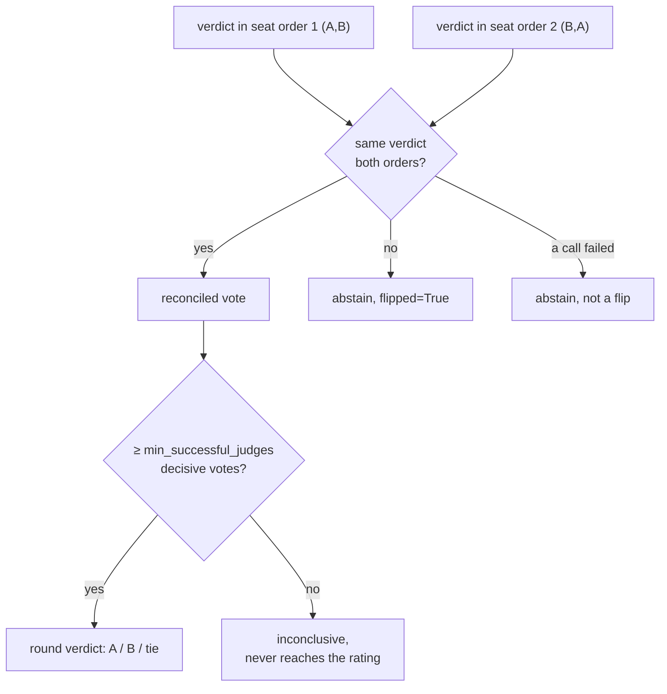

# Methodology

How orq-arena turns judged pairwise rounds into a Bradley-Terry ELO rating, the judging
protocol, the scoring math, the confidence intervals, the agreement and bias metrics that let you
audit the panel, the reliability and reproducibility policies, and what the committed example run
demonstrates.

## Plain-English summary

For every round, one prompt, two candidates, in a tournament:

1. Both candidates stream a response to the same prompt through the same orq.ai router gateway
   call.
2. evaluatorq's pairwise jury compares the two responses. **Every judge sees the pair twice, once
   in each seat order**, and its two verdicts are reconciled into one vote. A judge that
   contradicts itself between orders **abstains** rather than being averaged or trusted on a coin
   flip.
3. If fewer than `min_successful_judges` (default 2) judges cast a decisive vote, the round is
   `inconclusive`: it never reaches the rating.
4. Every other judged round, a win for A, a win for B, or a tie, feeds a **Bradley-Terry
   maximum-likelihood** fit across every round judged so far in the tournament; ties count as
   half a win each.
5. Bradley-Terry produces one rating per candidate, anchored so the field's geometric mean sits at
   1000, plus a 200-resample percentile **bootstrap 95% confidence interval** on every rating,
   and a **length-controlled rating** that refits the same rounds with the jury's length
   preference priced out.
6. Alongside the rating, the run reports how often judges agreed with each other (Fleiss'/Cohen's
   κ), how often each individual judge flipped between seat orders, and the jury's fitted
   **length coefficient**, public, per-judge evidence of how much to trust that vote.

The rest of this page is the detail behind those six steps, plus what the committed example run
demonstrates.

## Judging protocol

Every round's two responses are scored by an evaluatorq pairwise jury, built once per match from the config's `judges` list minus
whichever judge is also a contestant in that specific match, self-judge exclusion. (If that
would empty the panel, the match raises instead of judging with a compromised jury.) Each
`.compare(question, response_a, response_b)` call then runs the whole panel in **both seat
orders**, concurrently:

- **Order 1**: A = candidate A's response, B = candidate B's response.
- **Order 2**: A = candidate B's response, B = candidate A's response (un-swapped back to the
  canonical A/B frame before reconciliation).

This dual-ordering design is the standard defense the Chatbot-Arena family of methodologies uses
against position bias, a well-documented tendency for LLM judges to prefer whichever answer they
see first.

One bias survives both blinding and seat-swapping: **self-preference**. LLM judges recognize
their own family's prose stylistically and favor it (Panickssery et al., NeurIPS 2024), so
excluding the exact self-judge per match is necessary but not sufficient. When any configured
judge shares a provider family with any candidate, preflight prints a family-overlap warning; the run proceeds, but the ranking ships with that
caveat on record. The clean setup is a jury drawn entirely from families outside the pool.

### Consistency gating, a flip is an abstention, not a coin flip



For each judge, the two verdicts (one per ordering) are reconciled:

- **Same verdict both times** → that becomes the judge's reconciled vote for the round.
- **Different verdict each time** → the judge disagreed with itself; it **abstains**
  (`vote=None`) and is recorded with `flipped=True`.
- **A missing or failed verdict on either ordering** → also abstains, but is *not* counted as a
  flip, it never got the chance to contradict itself.

This is orq-arena's core bias control. Rather than trust a single, possibly position-biased vote,
or silently average two contradictory answers, an inconsistent judge is removed from that round's
tally, and the inconsistency itself becomes reported data (see per-judge flip rates below).

### Quorum, no jury of one

A round only produces a real verdict once at least `min_successful_judges` (default **2**,
`orq_arena.yaml`'s `min_successful_judges` key) judges cast a decisive reconciled vote. Below
that floor, evaluatorq's `run_pairwise` returns `winner='inconclusive'` regardless of what the
surviving vote(s) say, one consistent judge is never enough to decide a round on its own. If a
primary judge's call fails outright (an API error, not a flip), a configured `replacement_judges`
stand-in is promoted for that pair and runs in both orderings so it can cast a full reconciled
vote in its place.

### Criteria

All judges score against the same free-text criteria for the whole run, `orq_arena.yaml`'s
`criteria` key, default `"Accuracy and correctness, helpfulness and completeness, clarity, and
relevance to the prompt."` It can be swapped for a single re-judge without touching the YAML
(`orq-arena rejudge ... --criteria "..."`; see
[Jury swapping](#jury-swapping-re-judge-without-regenerating) below). Full field reference:
[Configuration → judges, replacement_judges, criteria, min_successful_judges](configuration.md#judges-replacement_judges-criteria-min_successful_judges).

## Scoring: what the rating sees, and what the TUI shows

This is the distinction most worth getting right: **the rating is built from per-round judged
verdicts, and the HP bar in the TUI is a separate, presentation-only recomputation of those same
verdicts.** The engine itself no longer tracks HP at all.

### HP lives entirely in the TUI

There is no HP or damage in the scored pipeline. The live show recomputes health bars, damage
tiers, and KO client-side from the judged verdicts, purely
for the drama on screen: a unanimous round drops the bar further than a split one, and a bar
reaching zero draws a KO. The `match.starting_hp` / `damage_unanimous` / `damage_majority` config
keys feed only this display (see
[Configuration → match](configuration.md#match-matchrules)); none of them reach the rating.

The match winner is decided by **judged round wins**: whichever side won more rounds takes the
match, and equal round wins is a draw (an empty winner, `MatchResolved`/`MatchResult` no longer
carry a `by` field). That per-match outcome drives the on-screen story only. Every prompt in the
drawn slice is always judged regardless of where the HP bar happens to sit, and the turn loop
keeps drawing prompts until `match.max_rounds` decisive rounds have counted.

### The rating is per-round, not per-match

Live standings and the final leaderboard are **not** derived from the per-match winner at all.
After every match, the driver walks that match's records and extracts one outcome per
**judged round**:

- `majority_verdict == "A"` → a win for A
- `majority_verdict == "B"` → a win for B
- `majority_verdict == "tie"` → a tie
- `majority_verdict == "inconclusive"`, or a voided round (`error` set) → **dropped**: not fed
  to the rating, and specifically never counted as a tie.

That per-round outcome list, never the per-match winner, is what the rating fits. A default 8-candidate round-robin
(`match.max_rounds=5`) therefore rates on up to `C(8,2) × 5 = 140` round-level comparisons pooled
across the whole field, not the 7 match-level wins any single candidate would show on the
match scoreboard (each candidate meets every other candidate exactly once).

## Ratings: Bradley-Terry with ties, bootstrapped CIs, per-category slices

### Per-round Bradley-Terry MLE

orq-arena fits a standard Bradley-Terry model (Bradley & Terry, 1952) by iterative
maximum likelihood over the per-round outcome list above:

- Every win/loss increments a wins matrix by 1.0.
- **Ties split 0.5/0.5**: `build_wins_matrix` adds 0.5 to both directions on a tie, the
  standard Bradley-Terry tie convention.
- Ratings refit for up to 100 iterations (tolerance `1e-6`), renormalized each iteration, then
  converted to a familiar scale via `400 × log10(rating) + 1000`, anchored so the field's
  geometric mean sits at **1000**.

Standings recompute after every match, so the TUI's live leaderboard always reflects the current
fit over every round judged so far, not a value frozen at tournament design time.

### 95% confidence intervals

The confidence intervals resample the full outcome list with replacement **200 times** (seeded,
`seed=42`), refits Bradley-Terry on each resample, and reports each candidate's 2.5th/97.5th
percentile rating across the 200 refits as its 95% CI. On a small pool this produces **wide,
overlapping intervals**, that is not hidden, it is the honest statistical output of a benchmark
built on a limited number of comparisons; the module's own comment says as much: "Small pools +
few comparisons => wide intervals, which is the honest output." Read overlapping CIs on the
leaderboard as "not statistically distinguishable at this sample size," not as a tie.

### Style control: the length confound, priced out

Seat-swapping fixes position bias and nothing else; a jury that prefers the *longer* answer
prefers it in both orders. The field's standard correction (LMArena style control,
length-controlled AlpacaEval) is to estimate that preference jointly with model strength instead
of pretending it isn't there. orq-arena refits Bradley-Terry as a logistic regression with
one extra term per round:

```
P(A wins) = sigmoid(theta_A - theta_B + gamma * d),   d = (len_A - len_B) / (len_A + len_B)
```

fit over the same judged rounds (ties enter as y = 0.5), anchored like the raw fit so the
field's geometric mean sits at 1000. Two numbers come out:

- **`gamma`, the jury's length coefficient**, printed with the standings. Positive means the
  panel favored longer answers; the magnitude says how much.
- **The len-ctrl ELO**, the rating with the length term zeroed: what the ranking looks like once
  the jury's length preference is priced out. It appears as its own leaderboard column next to
  the raw ELO, never instead of it.

A large raw-vs-len-ctrl gap on your run means verbosity, not quality, is doing the separating;
read the len-ctrl column before crowning anyone. This controls response *length* only; markdown
and formatting features (headers, lists, bold) are a known further refinement, not yet built.

### Per-category slices

`elo_by_category` refits Bradley-Terry separately within each prompt category (`code`, `general`,
`math`, `creative` in the shipped prompt set), but **only for categories with at least 20
comparisons** (`MIN_CATEGORY_COMPARISONS = 20`). Thinner slices are dropped from the report
rather than shown with misleadingly precise ratings. On the shipped 30-prompt starter bank (see
[Current limitations](#current-limitations)), most categories will not clear that floor in a
single round-robin run, per-category breakdowns become meaningful once you scale the prompt set
or accumulate multiple runs.

## Agreement and bias metrics

Every finished run reports three families of numbers whose purpose is to let you audit the panel
that produced your rating, not just take it on faith.

### Mean agreement

`mean_agreement` is the mean modal-vote share across rounds with at
least two decisive votes, for each such round, what fraction of the decisive votes agreed with
the plurality. A round with exactly one decisive vote is excluded rather than scored as 100%
agreement, since a single vote can't agree or disagree with anything.

### Fleiss' and Cohen's κ

The run computes chance-corrected inter-judge agreement, because raw agreement
inflates whenever most rounds have an obvious winner:

- **Fleiss' κ (1971)** is computed over rounds where **every** primary panelist
  voted decisively, abstentions and replacement judges make a round's vote count non-uniform,
  which Fleiss' formula assumes fixed, so partial rounds are excluded and that exclusion is
  reported alongside as `rounds_used` / `rounds_total` coverage.
- **Cohen's κ (1960)** is computed per judge pair, over just that pair's
  co-decisive rounds, a looser bar that tolerates one judge abstaining while another decides.
- Both map onto **Landis & Koch (1977)** labels: <0 poor, ≤0.20 slight, ≤0.40 fair, ≤0.60
  moderate, ≤0.80 substantial, >0.80 almost perfect.

### Per-judge flip rates, position bias, made public

Each judge's reported `position_bias` is its flip rate: flips over pairs
where flipping was even possible (both seat orders returned a decisive verdict, a failed call
never had the chance to contradict itself and doesn't dilute the rate). This number, and the
individual flip badges shown in the TUI's battle browser, are the project's most direct public
evidence of judge bias: the leaderboard does not hide that some judges are less positionally
consistent than others, it reports the rate per judge and lets the quorum described above act on
it.

## Reliability policies

The rating should reflect a candidate's words, never the network's mood. Three policies enforce
that.

### Void on stream failure, after exactly one retry

Each side of a round gets one retry if its stream dies. A
second failure **voids the round**: `BattleRecord.error` is set, a `RoundVoided` event fires, and
the round is excluded from `outcomes_from_records` entirely, never judged, never rated, but
logged and shown in the TUI so a voided round is visible, not silently dropped from the count.

### Timeouts are read-gap, not total-duration

`gateway.stream_read_timeout_s` (default `1200` seconds / 20 minutes) is a **read-gap** timeout,
the connection is only treated as dead after that many seconds pass with *no new chunk arriving*,
not after the stream has simply been open that long. A model that reasons silently for minutes
before its first token is never penalized for being a slow thinker; only a connection that has
genuinely gone silent times out.

### Truncation is judged, not hidden, but it stays visible

There is no retry or exclusion path for a truncated response: if a candidate's output is cut off by
its token cap, the round is judged normally on the truncated text. `finish_reason` (e.g.
`"length"`) is recorded per side on the `BattleRecord` and surfaced as a `✂ truncated` flag in the
TUI's response panel, the jury sees exactly what the reader sees, and a truncation-driven loss is
legible rather than mysterious. See `gateway.candidate_max_tokens` / `gateway.judge_max_tokens` in
[Configuration](configuration.md#gateway-gatewayconfig), an under-sized `judge_max_tokens` cap
starving a thinking-by-default judge's own verdict is exactly the kind of failure this policy is
designed to make visible rather than silently absorb.

## Reproducibility

Every run is seeded and manifested so its rating can be audited or re-derived after the fact:

- **Seeded schedule and prompt slices**: the pairing order and every match's prompt slice are drawn
  from one seeded random generator (default `seed=42`). Every slice is pre-drawn before any match starts, so the schedule stays stable regardless
  of completion order under concurrency.
- **A run manifest, written twice**: the run writes `<output>.run.json` immediately at tournament start (config hash, prompt hash, roster, judge
  panel, replacement judges, quorum, the installed `evaluatorq` version, `started_at`) and
  rewrites it at the end with `finished_at` plus the closing report's `mean_agreement`,
  `error_rounds`, `rated_rounds`, `category_counts`, `fleiss`, `length_coef` (the jury's fitted
  length coefficient, see [Style control](#style-control-the-length-confound-priced-out)), and
  token totals.
- **Content-addressed hashes, not filenames**: `config_sha256` and `prompts_sha256` are SHA-256
  digests (first 16 hex characters) of the serialized config and the newline-joined prompt texts,
  so two runs against the same config and prompt content are provably comparable even if either
  file got renamed in between.
- **The evaluatorq version is pinned into the manifest itself**, so a rating produced under one evaluatorq release stays
  distinguishable from one produced under another, even if the installed version drifted between
  runs.

## Jury swapping: re-judge without regenerating

`orq-arena rejudge <battles.jsonl> --judge <id> [...]` re-scores every
recorded round's **already-generated responses** against a new judge panel, no candidate calls,
judge tokens only. It then reports whether the new panel's ranking agrees with the original:

- `spearman(old_rank, new_rank)`: rank correlation between the Bradley-Terry ranking implied by
  the original judged verdicts and the ranking implied by the re-judged verdicts, both computed
  the same way (`bradley_terry_mle` over the respective outcome list).
- `changed_verdicts`: the raw count of individual rounds whose `majority_verdict` flipped
  between the two panels, independent of whether that changed the overall ranking.
- The CLI's own read of the result: Spearman ≥ 0.8 is reported as "judge-robust ranking"; below
  that, "ranking is panel-sensitive; treat with care."

The re-judge panel's own quorum is clamped to its own size
(`min(cfg.min_successful_judges, len(panel))`), so a legitimate single-judge re-judge, useful
specifically as a contrast baseline against the full panel, see Measured evidence below, is not
rejected by a quorum sized for the original run's larger panel.

This is the project's answer to "how do I know the ranking isn't just an artifact of which judges
I happened to pick?", swap the jury, keep the responses, and measure rank stability directly
instead of asserting it.

## Human anchor: does the panel agree with people?

Everything above measures the panel against itself. The human-anchor workflow measures it
against people, the accuracy claim reliability metrics cannot make:

1. `orq-arena annotate <log>` renders the recorded rounds into one self-contained, **blind**
   annotation page: no model names, no jury votes, no verdicts in the
   payload; rounds shuffled and sides swapped per round under a seed; round keys are one-way
   hashes. The same seat-order discipline applied to the jury applies to the human, a rater
   can't favor a side or a model they can't identify. Send the file to 2-3 raters (guidelines,
   round count, and a time estimate are shown up front; the rubric shown is `--criteria`,
   default identical to the jury's default).
2. Each rater's votes come back as `votes.json`, exported in the canonical A/B frame (the page
   un-flips before export, so vote files are independent of presentation order).
3. `orq-arena anchor <log> votes.json […]` treats each human as one more judge and reports,
   per rater: **Cohen's κ vs the panel majority** (over rounds where the panel was decisive;
   inconclusive rounds are excluded from κ but still feed the human Bradley-Terry fit),
   the **Spearman correlation between the human-vote Bradley-Terry ranking and the panel's**,
   and, with several raters, **inter-annotator κ** per pair.

Read the numbers the same way as the jury metrics: κ says whether the panel's round-level
verdicts track human preference; the rank correlation says whether disagreements, where they
exist, actually move the leaderboard. One residual bias survives the blinding: a rater who
works with these models daily may recognize a family's prose style, the same self-preference
caveat the jury carries, so prefer raters who don't, and report who rated alongside the
numbers.

## Measured evidence: the committed example run

This repository ships a real recorded run at
[`examples/quickstart/`](https://github.com/orq-ai/orq-arena/tree/master/examples/quickstart),
so the mechanisms above are not just described, they are demonstrated on committed artifacts you
can inspect and reproduce yourself. It is a small **4-model, thinking-OFF pool** (a full
round-robin, `C(4,2) = 6` matches) judged by the shipped 3-judge default panel, chosen to be fast
and cheap to regenerate rather than to be a rigorous benchmark.

!!! example "Read the numbers yourself"

    The numbers below are from the committed `examples/quickstart` run. Open
    `examples/quickstart/battles.report.html` to read them, or regenerate the report from the
    committed log with `orq-arena report examples/quickstart/battles.jsonl`. To re-run the whole
    tournament from scratch, use the command in `examples/quickstart/config.yaml`'s header.

What the committed run lets you see end to end, on real data:

- **The full pipeline on committed artifacts**: `config.yaml` (the roster and rules),
  `battles.jsonl` (one row per judged round, both responses and per-judge reconciled votes),
  `battles.run.json` (the seeded manifest, config/prompt hashes, panel, agreement stats), and the
  regenerable HTML report. Nothing here is simulated.
- **The agreement and bias metrics in context**: open the report's jury-behaviour table and the
  manifest's `mean_agreement` / `fleiss` fields to read how consistently that panel voted and how
  often each judge flipped between seat orders, then compare `rated_rounds` against the total
  round count to see how many rounds actually reached the rating.
- **Jury cost dominance**: the manifest's token totals show how much of a run's spend the panel
  accounts for (two seat orders times a multi-judge panel, on every round, adds up fast), against
  the candidates' own token use.
- **Rank stability under a jury swap**: re-judge the committed log with a different panel
  (`orq-arena rejudge examples/quickstart/battles.jsonl --judge ...`) and read the Spearman
  correlation the command prints, the direct test that the ranking is not an artifact of which
  judges were picked.

!!! warning "The honest reading"

    A cheap multi-judge panel tends to abstain on *close* pairs, and the
    quorum then correctly refuses to force a verdict out of a panel that can't agree with itself. A
    high inconclusive rate is the consistency gate doing its job, not evidence the rating is
    unreliable, but it does mean a cheap panel rates on fewer rounds than it judges. Check
    `rated_rounds` against the total round count in your own run's manifest (the committed example's
    included) before leaning on a close pairwise gap.

## Current limitations

Stated plainly, so you can weigh them against your own use case:

- **30-prompt starter bank.** The shipped `prompts/starter.jsonl` has 30 prompts across four
  categories (code 8, general 11, math 6, creative 5), enough to exercise every mechanism on
  this page, but well below the 20-comparison-per-category floor within a single round-robin run
  (`match.max_rounds=5` draws only 5 prompts per match). Treat the shipped bank as a smoke test,
  not a rigorous benchmark, until you supply your own larger prompt set.
- **No human-anchor *results* yet.** The workflow now exists
  ([Human anchor](#human-anchor-does-the-panel-agree-with-people): `annotate` + `anchor`), but
  no study has been run and published against it. Until then the Fleiss'/Cohen's κ numbers
  above still only measure *judges agreeing with each other*, not *judges agreeing with
  people*, a self-consistent panel is not the same claim as an accurate one. Target: 50-100
  rounds, 2-3 blind raters.
- **Style control covers length only.** The len-ctrl rating (see
  [Style control](#style-control-the-length-confound-priced-out)) corrects for response length;
  markdown/formatting covariates (headers, lists, bold), which LMArena's full style control also
  regresses out, are not modeled yet. The prompt bank's `length_bucket` field (`short`/`medium`)
  is likewise not used yet.
- **One free-text criteria string per run.** Every judge scores every prompt category against the
  same `criteria` field, there is no per-category or per-prompt-type rubric today, so a run
  spanning very different prompt types (code correctness vs. creative writing) is judged against
  one general-purpose bar.
