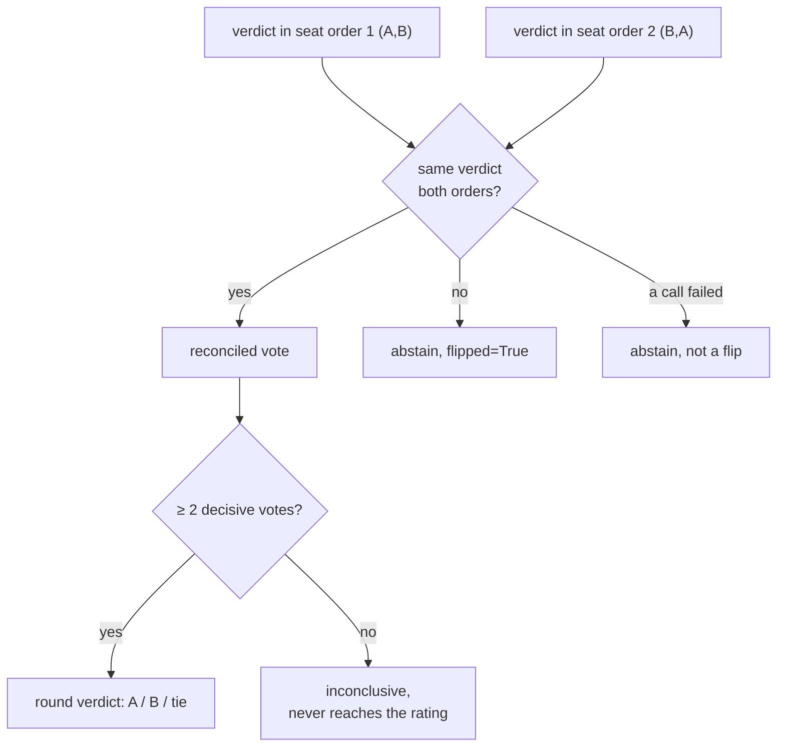

# Methodology

How orq-arena turns judged pairwise rounds into a ranking you can audit. This page is the
overview of the principles; the implementation itself is open source and is the full detail.

## How it works

For every round, one prompt, two candidates, in a round-robin tournament:

1. Both candidates answer the same prompt through the same orq.ai router gateway.
2. An evaluatorq jury compares the two responses. Every judge sees the pair twice, once in
   each seat order; a judge that contradicts itself between orders abstains rather than being
   trusted on a coin flip.
3. If fewer than two judges cast a decisive vote, the round is inconclusive and never reaches
   the rating.
4. Every judged round (win, loss, or tie) feeds a Bradley-Terry fit over all rounds so far.
5. The fit produces one rating per candidate with a bootstrap 95% confidence interval, plus a
   length-controlled rating that prices out the jury's verbosity preference.
6. The run also reports how much the judges agreed with each other and how often each one
   flipped between seat orders, public evidence of how much to trust the verdicts.

## Judging

**Both seat orders, always.** LLM judges measurably favor whichever answer they see first
(Zheng et al., 2023), so every judge scores each pair twice with the sides swapped:

A judge that gives a different verdict in each order abstains for that round, and the flip is
recorded. A round needs at least two decisive votes (configurable) to produce a verdict;
otherwise it is dropped from the rating rather than decided by a jury that could not agree
with itself.

**Self-preference.** LLM judges recognize and favor their own family's prose (Panickssery et
al., 2024). A judge that is also a contestant is excluded from its own matches, and the
preflight warns whenever a judge shares a provider family with any candidate. The clean setup
is a jury drawn entirely from families outside the pool.

All judges score the same free-text criteria for the whole run (configurable, and swappable
after the fact with `rejudge`).

## Ratings

**Bradley-Terry, not incremental Elo.** Ratings come from a maximum-likelihood Bradley-Terry
fit (Bradley & Terry, 1952) over every judged round, refit as the tournament progresses; ties
count as half a win for each side. This is the same statistical core as Chatbot Arena's
leaderboard (Chiang et al., 2024). Ratings are anchored so the field's average sits at 1000.

**Confidence intervals.** A 200-resample bootstrap gives each candidate a 95% CI. On a small
run the intervals are wide and overlapping; that is the honest output, and overlapping CIs
should be read as "not statistically distinguishable at this sample size", not as a tie.

**Length control.** Seat-swapping fixes position bias, not verbosity bias: a jury that likes
longer answers likes them in both orders. Following length-controlled AlpacaEval (Dubois et
al., 2024) and LMArena's style control, the fit is repeated with a length term, producing the
jury's length coefficient (printed with the standings) and a len-ctrl rating column with that
preference priced out. A big raw-vs-len-ctrl gap means verbosity, not quality, is doing the
separating. Length is the only style axis controlled today; markdown formatting is not.

**Per-category slices.** Ratings are also refit per prompt category, but only for categories
with enough comparisons to mean anything; thin slices are dropped instead of shown with
misleading precision.

## Auditing the jury

Every run reports the numbers needed to challenge its own ranking:

- **Agreement**: mean modal-vote share per round, plus chance-corrected Fleiss' and Cohen's
  kappa with the standard Landis-Koch labels (slight to almost-perfect).
- **Per-judge flip rates**: how often each judge contradicted itself between seat orders,
  published per judge rather than hidden in an average.
- **Jury swap**: `rejudge` re-scores the recorded responses under a different panel (judge
  tokens only, zero regeneration) and reports the Spearman rank correlation against the
  original ranking, the direct test that the ranking is not an artifact of which judges were
  picked.

## Reliability

- **Failed streams void the round.** One retry per side; a second failure voids the round,
  which is logged and shown but never judged or rated. The rating reflects the candidates'
  words, never the network's mood.
- **Timeouts measure silence, not duration.** A stream only dies after a long gap with no new
  chunk, so a model that thinks for minutes before its first token is not penalized.
- **Truncation is judged, not hidden.** A response cut off by its token cap is judged as-is
  and flagged visibly; the jury sees exactly what a reader would see.

## Reproducibility

Every run is seeded (schedule and prompt draws) and writes a manifest next to the battle log
with content hashes of the config and prompt set, the judge panel, and the closing agreement
stats, so two runs are provably comparable and any rating can be re-derived from its log.

## Human anchor: does the panel agree with people?

The jury metrics above measure the panel against itself; the human-anchor workflow measures
it against people. `annotate` renders a recorded run into a blind annotation page (no model
names, no jury votes, sides swapped per round) you can send to raters; `anchor` merges their
votes back and reports each rater's kappa against the panel majority and the rank correlation
between the human ranking and the panel's. Usage: [cli.md](cli.md#annotate).

## Current limitations

- **The shipped 30-prompt bank is a smoke test**, sized to exercise every mechanism, not to
  defend a ranking. A ranking you intend to defend takes your own prompt set (hundreds of
  rounds) and judges from families outside the pool.

## References

- Bradley & Terry (1952). Rank Analysis of Incomplete Block Designs: The Method of Paired
  Comparisons. [doi:10.2307/2334029](https://doi.org/10.2307/2334029)
- Zheng et al. (2023). Judging LLM-as-a-Judge with MT-Bench and Chatbot Arena.
  [arXiv:2306.05685](https://arxiv.org/abs/2306.05685)
- Chiang et al. (2024). Chatbot Arena: An Open Platform for Evaluating LLMs by Human
  Preference. [arXiv:2403.04132](https://arxiv.org/abs/2403.04132)
- Dubois et al. (2024). Length-Controlled AlpacaEval: A Simple Way to Debias Automatic
  Evaluators. [arXiv:2404.04475](https://arxiv.org/abs/2404.04475)
- Panickssery et al. (2024). LLM Evaluators Recognize and Favor Their Own Generations.
  [arXiv:2404.13076](https://arxiv.org/abs/2404.13076)
